# Agent Pipeline — session start → GitHub merge

How a change flows through this repo's agent workflow: where **plan mode** gates,
which **subagents** review, which **skills** run, and which **guardrails** (hooks,
local gates, CI) it has to pass before `main`.

The rules behind every node live in [AGENTS.md](../AGENTS.md) (canonical, tool-neutral)
and [CLAUDE.md](../CLAUDE.md) (Claude-only wiring). This diagram is the map; those files
are the contract.

## The flow

```mermaid
flowchart TD
    Start([Session start<br/>opusplan · high effort]) --> Investigate

    subgraph INV [" "]
        direction TB
        Investigate["🔍 Investigate / read<br/><i>free-form, no gate</i>"]
        Arch{"Touches architecture,<br/>crypto, trust boundary,<br/>roadmap order?"}
        Investigate --> Arch
        Arch -- yes --> SA["🤖 security-architect<br/><i>Fable high · read-only</i><br/>returns a plan to implement"]
        Arch -- no --> Gate
        SA --> Gate
    end

    Gate{{"⛔ PLAN-MODE GATE<br/>any edit headed for a PR<br/>enters plan mode FIRST"}}
    Gate --> Plan["📋 Plan in plain language<br/>what changes · what breaks · how verified"]
    Plan --> Approve{Owner approves?}
    Approve -- no --> Plan
    Approve -- yes --> Skills

    subgraph SK ["Procedure skills (run as the task needs)"]
        direction LR
        Skills["/feature-threat-model<br/>/db-migration<br/>/api-spec"]
    end
    Skills --> Implement["✍️ Implement on session model<br/><i>tight diffs, match conventions</i>"]

    Implement --> Hooks{{"🪝 Edit-time hooks<br/>destructive-bash guard<br/>+ invariant checks"}}

    subgraph DOM ["Domain reviewers — after non-trivial changes in their area"]
        direction LR
        Crypto["🤖 crypto-reviewer<br/>crypto · keys · envelope"]
        Boundary["🤖 security-boundary-auditor<br/>RLS · authz · logs · API"]
        Infra["🤖 infra-reviewer<br/>Terraform · Compose · CI"]
    end
    Hooks --> Crypto & Boundary & Infra

    Crypto & Boundary & Infra --> LocalGates

    subgraph GATES ["Local gates (must pass)"]
        direction TB
        LocalGates["pnpm -r typecheck<br/>pnpm -r test"] --> SelfReview["/code-review (medium)<br/>over full branch diff<br/>→ fix must-fix findings"]
        SelfReview --> Commit["git commit"]
        Commit --> PreCommit{{"🪝 pre-commit (lefthook)<br/>gitleaks · ESLint · Prettier · Semgrep"}}
        PreCommit --> Push["git push -u origin branch"]
        Push --> PrePush{{"🪝 pre-push<br/>typecheck · tests"}}
    end

    PrePush --> PR["📬 gh pr create<br/><i>PR body for a non-programmer owner<br/>+ How to verify by hand</i>"]

    PR --> Reviews
    subgraph REV ["Dual review + CI — run concurrently, neither is skippable"]
        direction TB
        Reviews["Request BOTH:<br/>@codex review<br/>@claude review … VERDICT: PASS/FINDINGS"]
        CI{{"⚙️ CI: ci · security · codeql<br/>Semgrep · OSV · Trivy · Checkov<br/>gitleaks · 42Crunch · nightly DAST"}}
        Reviews --> Status["review-status.sh --wait<br/>aggregates Codex + Claude"]
    end

    Status --> Verdict{Both clean<br/>AND CI green?}
    CI --> Verdict
    Verdict -- "findings / red CI" --> Fix["Fix → push →<br/>re-request both reviews"]
    Fix --> Hooks
    Verdict -- yes --> Merge([" gh pr merge<br/>human-driven · the one manual step "])

    classDef gate fill:#3a1c1c,stroke:#e05a5a,color:#fff,stroke-width:2px;
    classDef guard fill:#2a2140,stroke:#9a7ad6,color:#fff;
    classDef agent fill:#13313a,stroke:#3fa7c4,color:#fff;
    classDef skill fill:#1e3320,stroke:#5fb86a,color:#fff;
    classDef terminal fill:#222,stroke:#888,color:#fff;

    class Gate gate;
    class Hooks,PreCommit,PrePush,CI guard;
    class SA,Crypto,Boundary,Infra agent;
    class Skills,SelfReview skill;
    class Start,Merge terminal;
```

## Legend — what each shape is

| Shape / colour | Meaning | Examples |
|---|---|---|
| 🔴 Red hexagon | **Hard gate** — work cannot proceed past it | Plan-mode gate |
| 🟣 Purple hexagon | **Guardrail** — automated, runs regardless of agent | edit-time hooks, pre-commit, pre-push, CI |
| 🔵 Blue box | **Subagent** — fresh-context reviewer/architect | `security-architect`, `crypto-reviewer`, `security-boundary-auditor`, `infra-reviewer` |
| 🟢 Green box | **Skill** — a scripted procedure | `/feature-threat-model`, `/db-migration`, `/api-spec`, `/code-review` |
| ◇ Diamond | **Decision** — branches the flow | "touches crypto?", "owner approves?" |

## The three things people miss

1. **The plan-mode gate triggers on the *edit*, not the vibe.** The moment a task is
   headed for a code change that ends in a PR, plan mode comes *before* the first
   Edit/Write — scoping the fix happens *inside* plan mode. Only trivial dictated edits
   (a typo, a one-line config value) skip it.

2. **`security-architect` runs *before* code, the other three run *after*.** It's a
   design step that returns a plan; the domain reviewers (`crypto` / `boundary` / `infra`)
   audit what you already wrote. Route through the one matching the area you touched.

3. **Green CI never merges on its own.** Both reviews — Codex *and* `@claude` — are equal
   and required. `review-status.sh --wait` reads every channel (formal reviews, comments,
   a bare 👍 from Codex, usage-limit failures) and reports an aggregate. Merge needs
   CI green **and** both verdicts resolved. The merge itself is the one step a human drives.

## Escalation, not model-switching

Heavy reasoning is reached by **delegating to a subagent**, never by raising the main
session model. `security-architect` and `crypto-reviewer` run Fable high; the other
reviewers run Opus high; the main loop stays on `opusplan`. See
[CLAUDE.md](../CLAUDE.md) → *Model & effort routing*.
