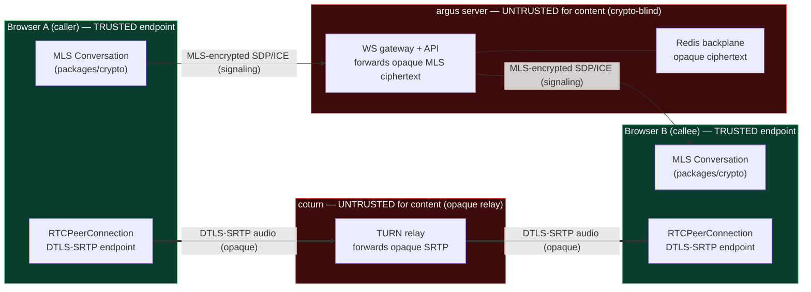

# 01 — Architecture & E2EE Crypto Model

> **Scope of this document.** The end-to-end **media security model** for argus 1:1 calls: how DTLS-SRTP secures media between two browsers, why the server and the self-hosted coturn relay stay crypto-blind, how we authenticate the call signal's **sender** and the DTLS certificate fingerprints **inside the existing MLS-encrypted channel** to defeat a man-in-the-middle, whether to additionally derive a media key from the MLS exporter, and the explicit upgrade path to SFrame for the future SFU/group phase. Infrastructure (the coturn-vs-Cloudflare-Tunnel tension, NSG rules, TLS) is covered in [./03-infrastructure-turn-and-networking.md](./03-infrastructure-turn-and-networking.md); the signaling wire format and state machine in [./02-signaling-protocol-and-state-machine.md](./02-signaling-protocol-and-state-machine.md); server API and DB shape in [./04-server-api-and-database.md](./04-server-api-and-database.md); PWA ring/wake limits and the WebRTC client in [./05-frontend-pwa-and-webrtc.md](./05-frontend-pwa-and-webrtc.md). Threat model: [./06-threat-model-and-privacy.md](./06-threat-model-and-privacy.md). Roadmap slices: [./08-roadmap-and-delivery-slices.md](./08-roadmap-and-delivery-slices.md). Open questions: [./09-decision-log-and-open-questions.md](./09-decision-log-and-open-questions.md).

> **V1 scope reminder (see [./00-overview-and-goals.md](./00-overview-and-goals.md) §4).** V1 is **1:1 audio only, relay-only, foreground-ring only, single-device per user.** Video, ICE-restart/reconnection, push-wake/missed-call ledger, and multi-device ring-all are **V1.1**. The crypto model below is written so audio V1 and the V1.1/group additions sit on one unchanged trust spine — but only the audio path is in scope for the first ship.

---

## 1. The media security model in one paragraph

A 1:1 call is a **WebRTC peer connection** between the two callers' browsers. The media (audio RTP packets in V1; video in V1.1) is encrypted with **SRTP**, and the SRTP keys are negotiated by a **DTLS handshake** that runs *inside* the established ICE transport — this is **DTLS-SRTP** (RFC 5763 / RFC 8827). The two browsers are the only parties that hold the DTLS-negotiated keys. Everything in the middle — our NestJS API, the WebSocket gateway, Redis, and the self-hosted **coturn** relay — moves **only ciphertext**. coturn forwards opaque encrypted SRTP datagrams; it has no DTLS key and cannot read or alter the media without detection ([WebRTC Security: DTLS-SRTP — Ant Media](https://antmedia.io/webrtc-security/), [Can a TURN server decrypt DTLS-SRTP? — discuss-webrtc](https://groups.google.com/g/turn-server-project-rfc5766-turn-server/c/IYPtCoKhKVQ)). The two things DTLS-SRTP cannot do by itself are prove *who sent the call signal* and prove *who is on the other end of the media* — both proofs are grafted on by authenticating the signal's MLS sender and carrying the DTLS certificate fingerprints **inside the MLS-encrypted signaling payload**, so call authenticity inherits argus's existing MLS trust (invariant #4) rather than trusting the signaling server.

---

## 2. Why the server and coturn stay crypto-blind (invariant #1)

DTLS-SRTP encrypts at the endpoints. The relay never holds a key:

| Element | Sees | Holds a DTLS/SRTP key? | Can read media? |
|---|---|---|---|
| Browser A / Browser B | plaintext media (local) | **yes** (own + peer fingerprint-verified) | yes — they are the endpoints |
| NestJS API + WS gateway (signaling) | opaque MLS ciphertext (SDP/ICE wrapped) | no | no |
| coturn (TURN relay) | opaque SRTP datagrams + 5-tuples | **no** | no |
| Redis (signaling backplane) | opaque MLS ciphertext | no | no |

coturn is a **packet forwarder operating below the crypto layer**. It allocates a relay address, applies channel/permission bindings (RFC 5766/8656), and copies UDP payloads between the two peers. The payload it copies is already a sealed DTLS-SRTP record; coturn has neither the certificate private keys nor the negotiated SRTP master key, so "even if media passes through a TURN server, it remains private" ([TURN Servers Explained — Medium](https://medium.com/@justin.edgewoods/https-www-softpagecms-com-2025-12-01-turn-servers-webrtc-reliable-voip-464592073080)). This is exactly analogous to how the API already treats `messages.ciphertext`: store/forward, never decrypt.

> **Hard rule for the coturn config (carried into [./03-infrastructure-turn-and-networking.md](./03-infrastructure-turn-and-networking.md)).** coturn runs as a **plain relay only**. We do **not** enable any coturn feature that would terminate or inspect media. coturn's own `turns:` TLS (5349) is a *transport* wrapper around the TURN control/data channel to look like HTTPS on the wire — it is **not** media termination; the inner DTLS-SRTP is still end-to-end and opaque to coturn. Misreading `turns:` as "TURN can see the media" is the classic mistake — it cannot.

**What metadata coturn and the server unavoidably learn** (and why that's acceptable): connection 5-tuples, relay allocation lifetimes, packet counts/timing, codec-independent volume. This is call **metadata**, not content — consistent with invariant #6 (no admin path to content) and the existing posture that logs carry IDs/metadata only (invariant #2). The relay-only IP-privacy default (see §6 and [./03-infrastructure-turn-and-networking.md](./03-infrastructure-turn-and-networking.md)) exists precisely so that the *peers* don't learn each other's IPs from this metadata; the operator still sees relay-side 5-tuples, which is inherent to running the relay. The call-graph/call-timing/relay-peer-IP exposure is enumerated in [./06-threat-model-and-privacy.md](./06-threat-model-and-privacy.md) and lands as new rows in `docs/threat-models/metadata-exposure.md`.

---

## 3. The MITM problem and how MLS solves it

### 3.1 The gap in raw DTLS-SRTP

DTLS-SRTP guarantees the media channel is encrypted to *whoever's certificate fingerprint was in the SDP*. It does **not** guarantee that fingerprint belongs to your friend. The fingerprints travel in the SDP offer/answer, and **the security of DTLS-SRTP collapses to the security of the signaling channel**: RFC 8827 states that signaling-channel integrity is a prerequisite, and "if the identity mechanism is not used, any on-path attacker can replace the DTLS-SRTP fingerprints in the handshake" ([RFC 8827 — WebRTC Security Architecture](https://datatracker.ietf.org/doc/html/rfc8827), [WebRTC and Man in the Middle Attacks — webrtcHacks](https://webrtchacks.com/webrtc-and-man-in-the-middle-attacks/)). TLS to the signaling server (WSS) is necessary but **not sufficient** for a privacy-first product: it only stops *off-path* attackers. It does **not** stop a **malicious or compromised signaling server** — which is exactly the adversary argus is designed to be safe against (the server is untrusted; that is the whole point of E2EE).

WebRTC's own answer to this is the **Identity Provider (IdP)** framework, but it "is rarely implemented in practice" ([RFC 8827](https://datatracker.ietf.org/doc/html/rfc8827)). argus already has something strictly stronger and already deployed: **MLS**.

### 3.2 The argus answer — carry fingerprints inside MLS, and authenticate the sender

**The DTLS certificate fingerprints are exchanged and verified inside the MLS-encrypted signaling payload, never as server-readable SDP.** Because MLS authenticates every group member's messages with their Ed25519 signing identity (RFC 9420), a fingerprint that arrives over the MLS channel is cryptographically bound to a specific, fingerprint-verified device — the same identity that protects every chat message. The signaling server forwards opaque ciphertext and **cannot substitute its own fingerprint**, because it cannot forge an MLS application message from the peer.

> **⚠️ This requires NEW, crypto-reviewer-gated code in `packages/crypto` — it is NOT "reuse only" (M1).** The honest statement: `Conversation.decrypt()` today returns a **bare plaintext string and surfaces no sender identity**. Confidentiality of the wrapped SDP is reused for free, but **authenticating *which member* sent a `call.offer`** — the thing that actually defeats a server-side MITM and a spoofed-caller — needs a new **authenticated-sender decrypt path** that returns `{ plaintext, senderLeafIndex / senderCredential }` alongside the bytes, sourced from the MLS framing the ts-mls layer already parses. This is a small, well-scoped addition, but it is **new crypto-surface** and must pass `crypto-reviewer` at max effort. It is a **hard Phase-0 predecessor of the first connecting call** — without it, a malicious server could relay an attacker's offer under a friend's `senderId` and the callee would have no cryptographic way to reject it. Do not describe the MITM defense as requiring zero new crypto.

Concretely, the SDP fingerprint is not put on the wire as cleartext SDP. The signaling payload (`call.offer` / `call.answer`, see [./02-signaling-protocol-and-state-machine.md](./02-signaling-protocol-and-state-machine.md)) is a JSON object **encrypted with the conversation's MLS group** before it leaves the device, exactly like a chat message:

```ts
// client-side, in the existing per-conversation MLS group
// (packages/crypto/src/index.ts — Conversation)
import { MlsEngine, Conversation } from '@argus/crypto';

// pc is the RTCPeerConnection; the local fingerprint is in its localDescription SDP
const offer = await pc.createOffer();
await pc.setLocalDescription(offer);

const signal = {
  kind: 'call.offer',
  callId,                       // CSPRNG (crypto.randomUUID), see §8
  sdp: offer.sdp,              // contains a=fingerprint:sha-256 ... (audio-only m-line in V1)
  media: 'audio',             // V1 = audio only; 'video' is V1.1
};

// Conversation.encrypt() returns opaque MLS mls_private_message wire bytes —
// "the only thing that leaves the device". The server never sees the SDP/fingerprint.
const wire: Uint8Array = conversation.encrypt(JSON.stringify(signal));
// → send `wire` (base64) over the signaling channel
```

On the receiving side, the **new authenticated-sender decrypt path** (the Phase-0 addition above) yields both the plaintext signal **and the verified MLS sender identity**. The receiver checks the sender is the expected friend *before* acting on the offer; it then hands `sdp` to `setRemoteDescription`, and WebRTC enforces, during the DTLS handshake, that the peer's presented certificate hashes to the `a=fingerprint` value we received. Chain of trust:

```
MLS group membership (Ed25519, fingerprint-verified out of band)
   └─ authenticates the SENDER of the MLS application message (NEW decrypt path)
        └─ message carries the SDP, which contains a=fingerprint:sha-256
             └─ which DTLS verifies against the peer's actual certificate
                  └─ which keys SRTP
                       └─ which encrypts the media
```

Every link is cryptographic; **the signaling server is not in the trust path.** A server that swaps the offer can only deliver garbage (a fingerprint it can't make the peer's cert match, or a frame whose MLS sender isn't the friend), which fails the sender check or the DTLS handshake — a **fail-closed** outcome (call won't connect), never a silent downgrade.

### 3.3 Reuse the existing out-of-band MITM defense for the *root* of trust

MLS membership authenticity itself rests on the out-of-band **safety-number / fingerprint** verification argus already ships — `safetyNumber`, `safetyNumberFromMember`, `enrollmentSafetyNumber` in `packages/crypto/src` (over public signature keys only). Calls inherit this root for free: if two users have already verified their safety number for the conversation, they have **already** authenticated the identity that the new sender-decrypt path now checks. **No new verification UX is required for V1** — but note the *enforcement* of that identity on the call signal is the new code in §3.2, not existing behavior. The existing "Verify security" surface (`apps/web/src/features/chat/` — `VerifySecurity`) remains the single MITM root for both chat and calls.

> **V1 decision.** Use MLS-wrapped SDP + authenticated-sender decrypt as the *sole* fingerprint-authentication mechanism. Do **not** implement the WebRTC IdP framework (rarely used, redundant given MLS) and do **not** add an in-call SAS/word-comparison ceremony in V1 — the conversation safety number already covers the root. An optional in-call SAS is listed as Nice-to-have in §7.

---

## 4. Should we also derive a media key from the MLS exporter? (V1: no; designed-for: yes)

ts-mls ships the RFC 9420 exporter (`mlsExporter`), and the epoch key schedule exposes `exporterSecret` — but the argus wrapper **does not currently re-export or call it** (confirmed: zero hits across `packages/crypto` and app source). So an MLS-derived media key is a *new capability*, not an existing one. Whether to add the shim in V1 is **Q5 in [./09-decision-log-and-open-questions.md](./09-decision-log-and-open-questions.md): ruled NO for V1**; if added, the `exportKey` shim is async (tracked as slice S12 in [./08-roadmap-and-delivery-slices.md](./08-roadmap-and-delivery-slices.md)).

There are two distinct ways MLS could touch the media keys. Keep them separate:

| Approach | What it does | V1? |
|---|---|---|
| **(a) MLS authenticates the DTLS fingerprint + sender** (§3) | Binds DTLS-SRTP to MLS identity. SRTP keys still come from DTLS. | **YES — this is V1** (with the new sender-decrypt path). |
| **(b) MLS exporter *supplies* the media key** | Derive a base key from `exporterSecret` and key SRTP/SFrame from it directly, independent of DTLS. | **NO in V1; this is the SFU/group upgrade path (§5).** |

**Why (a) alone is sufficient and correct for V1 1:1 P2P:** DTLS-SRTP already gives a fresh, forward-secret, per-call SRTP master key negotiated directly between the two endpoints; layering an MLS-exporter-derived key over a 1:1 P2P SRTP stream adds **no confidentiality** the relay can't already be excluded from (coturn never sees plaintext anyway) and adds real complexity (custom keying, `RTCRtpScriptTransform` / insertable streams plumbing). Simple-first wins: **authenticate** the DTLS keys via MLS (cheap, decisive against the untrusted-server MITM); don't **replace** them.

**Why (b) becomes necessary later:** the moment media flows through an **SFU** (group phase), the SFU is an on-path media element that *can* see the DTLS-SRTP plaintext (it terminates the hop-by-hop transport to route/forward streams). At that point DTLS-SRTP alone is no longer end-to-end. The fix is **SFrame** keyed from MLS — see §5.

**Design-for-(b) now, build later (cheap):** the eventual shim adds a single method to `Conversation` so the capability exists without wiring it into the call path yet:

```ts
// packages/crypto/src/index.ts — add to class Conversation (deferred to S12; no new dependency)
// Wraps ts-mls mlsExporter against this.state.keySchedule.exporterSecret.
async exportKey(label: string, context: Uint8Array, length: number): Promise<Uint8Array> {
  return mlsExporter(this.state.keySchedule.exporterSecret, label, context, length, this.cs);
}
```

> **Crypto-blindness caveat for `exportKey` (invariant #1/#2).** The derived secret must **never** be serialized toward the server. The only leak vector is a future code path that puts an exported key in an API request — guard it in review (`crypto-reviewer`). It is not a present risk because the method isn't wired at all yet.

---

## 5. Upgrade path to SFrame for the SFU/group phase (out of V1, designed-for)

When group calls arrive, media topology changes from P2P to **SFU** (selective forwarding unit). The SFU forwards each sender's stream to N receivers — and to do that it terminates the per-hop DTLS-SRTP. That makes the SFU a content-bearing element, which **directly violates invariant #1** unless media is encrypted *above* the transport, end-to-end, with a key the SFU never holds. The standard answer is **SFrame** (RFC 9605), keyed from **MLS**:

- SFrame encrypts each media frame at the sender and decrypts only at receivers; the SFU forwards opaque SFrame ciphertext, exactly as coturn forwards opaque SRTP today ([RFC 9605 — Secure Frame](https://www.rfc-editor.org/rfc/rfc9605.html)).
- The SFrame base key comes straight from the MLS exporter: `base_key = MLS-Exporter("SFrame 1.0 Base Key", "", AEAD.Nk)`, with per-member KID assignment for per-sender keys, re-keyed every MLS epoch ([Using MLS to Provide Keys for SFrame — draft-barnes-sframe-mls](https://datatracker.ietf.org/doc/html/draft-barnes-sframe-mls), [RFC 9605](https://www.rfc-editor.org/rfc/rfc9605.html)). Platforms increasingly pair SFrame with MLS, which handles key distribution and rotation as participants join and leave.

This is why §4 method (b) and the `exportKey` shim matter: the group phase **reuses the exact MLS group** that already protects the conversation's chat and (in V1) authenticates the call fingerprints. Browser plumbing is **Encoded Transforms** (`RTCRtpScriptTransform`, the successor to the older insertable-streams API) running the SFrame encrypt/decrypt in a worker.

**Designed-for checklist (V1 leaves these doors open, builds none):**

| Future need | What V1 must NOT foreclose | Status in V1 |
|---|---|---|
| MLS-keyed SFrame | The call uses the existing per-conversation MLS group | ✅ V1 wraps SDP in that same group |
| `exportKey` on `Conversation` | No second crypto path; one MLS engine | ✅ shim spec'd in §4, not wired (S12) |
| Encoded Transforms worker | Don't bake assumptions that media is unframeable | ✅ V1 is plain DTLS-SRTP, swappable |
| SFU as relay-only-of-ciphertext | Keep invariant #1 framing identical to coturn | ✅ same crypto-blind contract |

> **Decisive boundary:** SFrame, insertable streams, and the SFU are **explicitly out of V1**. V1 ships 1:1 audio over P2P DTLS-SRTP with an MLS-authenticated sender + fingerprints, full stop. The exporter method is a ~5-line, dependency-free shim we add *when* the SFU work starts (or at S12 if exporter-keying is pulled earlier) — not before (no premature abstraction).

---

## 6. IP privacy (relay-only default) and its crypto relevance

The per-user **relay-only** setting (default ON, and the *only* mode exercised in audio V1) forces all media through coturn by stripping `host`/`srflx` ICE candidates so only `relay` candidates remain — peers never learn each other's IP (full design in [./03-infrastructure-turn-and-networking.md](./03-infrastructure-turn-and-networking.md), DB column in [./04-server-api-and-database.md](./04-server-api-and-database.md)). Crypto note: relaying **does not weaken** the media crypto. The DTLS-SRTP keys are still negotiated end-to-end through the relay; coturn forwards ciphertext (§2). Relay-only trades a small latency/bandwidth cost for IP privacy with **zero** confidentiality loss. Power users may opt into direct P2P (host/srflx) — same DTLS-SRTP, just fewer hops — but that toggle is a post-audio-V1 surface; the default-on relay path is what ships first.

---

## 7. V1 vs deferred — decisive summary

**Must (V1 — 1:1 audio, relay-only, foreground-ring, single-device):**
- **Phase-0 predecessor:** the **authenticated-sender decrypt path** in `packages/crypto` (§3.2), crypto-reviewer-gated — without it the first connecting call cannot be MITM-safe.
- WebRTC 1:1 P2P, **DTLS-SRTP** for **audio** media; negotiate **DTLS 1.3** where supported and reject deprecated-only offers to block downgrade ([WebRTC Security — Ant Media](https://antmedia.io/webrtc-security/)).
- DTLS fingerprints exchanged **only inside MLS-encrypted signaling** via existing `Conversation.encrypt` + the new authenticated decrypt (§3).
- coturn as **opaque relay** (no media termination), relay-only IP privacy as the shipped default.
- Reuse existing safety-number verification as the MITM **root** of trust (no new UX; the *enforcement* on the signal is new code).

**Should (V1):**
- Per-call CSPRNG `callId`; metadata-only logging where any is kept (IDs/timestamps), never SDP/ICE/keys. (Note: V1 keeps **no `call_sessions` ledger** — see [./04-server-api-and-database.md](./04-server-api-and-database.md); the metadata ledger + prune chain is V1.1.)

**Nice to have (post-V1, not required):**
- Optional in-call SAS/word-comparison surfaced from the conversation safety number for an extra in-call confirmation.

**Enterprise-optional:**
- WebRTC IdP framework (redundant with MLS; skip unless an external federation requirement appears).

**Deferred to V1.1 / group phase (designed-for only):**
- **V1.1:** video media, ICE-restart/reconnection, push-wake + missed-call ledger, multi-device ring-all, the metadata-`call_sessions` ledger + `argus_call_prune` role + prune worker.
- **Group phase:** SFU topology, **SFrame (RFC 9605)** keyed via **MLS exporter** (§4b/§5), Encoded Transforms worker, `Conversation.exportKey` wiring.

---

## 8. CSPRNG & no-hand-rolled-crypto notes (invariant #4)

- **No hand-rolled crypto anywhere in the call path.** DTLS-SRTP is provided by the browser's WebRTC stack (BoringSSL/libwebrtc-grade); MLS comes exclusively from `packages/crypto` (ts-mls, RFC 9420). The argus call code writes **no** primitives — it only (a) calls `RTCPeerConnection`, (b) wraps the SDP via the existing `Conversation.encrypt`, and (c) unwraps + verifies the sender via the **new authenticated decrypt path** (which is plumbing over ts-mls framing, not a new primitive). SFrame, when it lands, comes from a vetted library keyed by `mlsExporter`, not a bespoke cipher.
- **CSPRNG only.** `callId` and any signaling nonces use `crypto.randomUUID()` / `crypto.getRandomValues()` — **never `Math.random`** (existing repo invariant). DTLS certificate generation and SRTP keying material are produced by the browser's CSPRNG-backed WebRTC implementation; MLS HPKE/AEAD randomness is ts-mls's CSPRNG. The per-conversation op-mutex in `Conversation` already prevents AEAD (key, nonce) reuse when encrypting signaling alongside chat.
- **Never log/persist secrets (invariant #2).** SDP (carries fingerprints + ICE), ICE candidates, DTLS/SRTP keys, and any future exporter-derived media key are **never** written to logs or the DB. The signaling channel forwards opaque MLS ciphertext only; V1 persists no call ledger at all, and any V1.1 `call_sessions` row is **metadata-only** (see [./04-server-api-and-database.md](./04-server-api-and-database.md)).

---

## 9. Invariant-by-invariant compliance check

| # | Invariant | How the call crypto model complies | Risk / watch-item |
|---|---|---|---|
| **1** | **Server is crypto-blind** | Media is DTLS-SRTP, end-to-end between browsers; coturn relays opaque SRTP and holds no key ([discuss-webrtc](https://groups.google.com/g/turn-server-project-rfc5766-turn-server/c/IYPtCoKhKVQ)). Signaling SDP/ICE rides **inside** MLS ciphertext, so the API/gateway/Redis see only opaque bytes. | coturn config must stay relay-only; never enable any media-inspecting feature. Reviewer: `infra-reviewer`. |
| **2** | **No plaintext/keys/secrets in logs or storage** | SDP, ICE, DTLS/SRTP keys, exporter keys never logged or persisted. V1 keeps no call ledger; any V1.1 `call_sessions` is metadata-only. Existing gateway already swallows write errors without surfacing content. | Add a log-scrub assertion for any new signaling handler; ensure SDP never lands in error logs. Reviewer: `security-boundary-auditor`. |
| **3** | **Every tenant table has `tenant_id` + RLS + leading index** | V1 signaling is **ephemeral, not persisted** (best-effort relay, no DB row) — **no new table** on the audio path. The V1.1 `call_sessions` metadata table, *if/when* added, follows the `0042_friendships.sql` template (tenant_id + ENABLE/FORCE RLS `to argus_app` with `nullif` guard + leading `tenant_id` index + composite FKs) and ships with its own `argus_call_prune` role per the [rls-public-policy-prune-bypass] lesson. | The DB-touching decision lives in [./04-server-api-and-database.md](./04-server-api-and-database.md); any table ships with full RLS or it's a block. |
| **4** | **No hand-rolled crypto; all via packages/crypto** | DTLS-SRTP from the browser stack; MLS via ts-mls in `packages/crypto`; fingerprint wrap via existing `Conversation.encrypt`; sender-authenticated unwrap via the **new crypto-reviewer-gated decrypt path** (plumbing over ts-mls framing). `exportKey`/SFrame are deferred and will use `mlsExporter` + a vetted SFrame lib. | The new decrypt path is new crypto-surface — **must** pass `crypto-reviewer` before the first connecting call. No primitive may appear in `apps/web` call code. |
| **5** | **Secrets from Key Vault via Managed Identity, as files** | coturn's TURN static-auth/shared secret is fetched by `infra/stack/secrets/fetch-keyvault-secrets.sh` and mounted as a 0444 tmpfs file (fits the existing pattern cleanly). No call secret in env. | coturn TLS cert (for `turns:`) must also arrive as a Key-Vault-delivered file, not be self-managed ad hoc — see [./03-infrastructure-turn-and-networking.md](./03-infrastructure-turn-and-networking.md). |
| **6** | **No admin path to content** | Admins/ops can see call **metadata** (who/when/duration/relay-used) but **never** media — there is no key on any server-side surface to decrypt SRTP, and signaling content is MLS ciphertext. | Keep any future admin call view metadata-only; no SDP/ICE exposure. |

---

## 10. System-context & call-setup sequence

### 10.1 System context (trust boundaries)



### 10.2 Call-setup sequence (relay-only default path, audio V1)

```mermaid
sequenceDiagram
  autonumber
  participant A as Browser A (caller)
  participant S as argus signaling<br/>(WS gateway, crypto-blind)
  participant T as coturn<br/>(opaque relay)
  participant B as Browser B (callee)

  Note over A,B: Both already in the same MLS conversation,<br/>safety number verified out-of-band (existing UX).<br/>V1 = both apps in foreground (real ring).

  A->>A: getUserMedia(audio); createOffer();<br/>setLocalDescription (SDP has a=fingerprint)
  A->>A: Conversation.encrypt({kind:'call.offer', callId(CSPRNG), sdp, media:'audio'})
  A->>S: signal frame = opaque MLS ciphertext
  S-->>B: forward opaque ciphertext (no decrypt)
  B->>B: authenticated decrypt -> verifies MLS SENDER == expected friend<br/>(NEW Phase-0 decrypt path; reject if mismatch)
  B->>B: getUserMedia(audio); setRemoteDescription(offer);<br/>createAnswer(); setLocalDescription (SDP has a=fingerprint)
  B->>B: Conversation.encrypt({kind:'call.answer', callId, sdp})
  B->>S: opaque MLS ciphertext
  S-->>A: forward opaque ciphertext

  par ICE trickle (both directions, relay candidates only)
    A->>S: Conversation.encrypt({kind:'call.ice', candidate=relay})
    S-->>B: forward opaque ciphertext
    B->>S: Conversation.encrypt({kind:'call.ice', candidate=relay})
    S-->>A: forward opaque ciphertext
  end

  Note over A,T,B: ICE picks relay candidates (relay-only setting strips host/srflx)
  A->>T: TURN allocate + channel bind (TURN auth: KV-delivered secret, TTL 600s)
  B->>T: TURN allocate + channel bind
  A-->>T: DTLS handshake records (opaque)
  T-->>B: relay DTLS handshake records (opaque)
  Note over A,B: DTLS verifies peer cert == a=fingerprint received over MLS<br/>(MITM by server fails closed here)
  A==>T: SRTP audio (DTLS-SRTP, opaque)
  T==>B: relay SRTP audio (opaque) — coturn holds no key
```

---

## 11. Where this lands in the codebase (pointers; detail in siblings)

- **Crypto — NEW Phase-0 work (crypto-reviewer-gated):** `packages/crypto/src/index.ts` — add the **authenticated-sender decrypt path** to `Conversation` (returns plaintext + verified MLS sender identity). Reuses existing `MlsEngine`, `Conversation.encrypt`, `safetyNumber*`. Deferred `Conversation.exportKey` (§4, S12) wraps the already-present-in-ts-mls `mlsExporter`.
- **Signaling client + call state (V1):** `apps/web/src/lib/ws.ts` (new `call_*` frames), new `apps/web/src/features/chat/useCall.ts`, new `apps/web/src/lib/media-devices.ts` (`getUserMedia`, **audio constraints only in V1**); inert call buttons already exist at `apps/web/src/features/chat/ChatHeader.tsx` (lines ~252–265). See [./02-signaling-protocol-and-state-machine.md](./02-signaling-protocol-and-state-machine.md) and [./05-frontend-pwa-and-webrtc.md](./05-frontend-pwa-and-webrtc.md).
- **Gateway relay (V1):** new `call.offer/answer/ice/hangup` handlers + bus events in `apps/api/src/realtime/` (ephemeral, **no DB write** in V1 — depart from the durable-then-notify pattern). See [./02-signaling-protocol-and-state-machine.md](./02-signaling-protocol-and-state-machine.md) and [./04-server-api-and-database.md](./04-server-api-and-database.md).
- **Relay infra (V1):** coturn service + the Cloudflare-Tunnel-vs-UDP resolution, NSG/SG inbound rules, KV-delivered TURN secret + `turns:` cert, **plus the P0 coturn healthcheck + uptime alert + runbook stub** (relay-default ⇒ coturn availability == calling availability). See [./03-infrastructure-turn-and-networking.md](./03-infrastructure-turn-and-networking.md).
- **Threat-model + GDPR artifacts (required before coding, Phase-0 DoD):** the MLS-sender/fingerprint MITM defense, signaling-metadata-over-Redis, and ephemeral best-effort drop semantics are written up in [./06-threat-model-and-privacy.md](./06-threat-model-and-privacy.md) and land as updates to the four canonical repo artifacts — revise `docs/gdpr/data-residency.md` (coturn relay row), revise `docs/gdpr/article-30-records.md` (new processing activity + APNs/FCM sub-processor + retention), **extend** `docs/threat-models/metadata-exposure.md` (call-graph/call-timing/relay-peer-IP rows), and **create** `docs/gdpr/dpia-voip-calling.md` (legal basis per activity).

---

**Sources**

- [RFC 8827 — WebRTC Security Architecture](https://datatracker.ietf.org/doc/html/rfc8827)
- [RFC 9420 — The Messaging Layer Security (MLS) Protocol](https://www.rfc-editor.org/rfc/rfc9420.html)
- [RFC 9605 — Secure Frame (SFrame)](https://www.rfc-editor.org/rfc/rfc9605.html)
- [draft-barnes-sframe-mls — Using MLS to Provide Keys for SFrame](https://datatracker.ietf.org/doc/html/draft-barnes-sframe-mls)
- [WebRTC Security: DTLS-SRTP, Encryption — Ant Media (2026)](https://antmedia.io/webrtc-security/)
- [WebRTC and Man in the Middle Attacks — webrtcHacks](https://webrtchacks.com/webrtc-and-man-in-the-middle-attacks/)
- [Can a TURN server decrypt DTLS-SRTP? — discuss-webrtc](https://groups.google.com/g/turn-server-project-rfc5766-turn-server/c/IYPtCoKhKVQ)
- [TURN Servers Explained — Medium (2025)](https://medium.com/@justin.edgewoods/https-www-softpagecms-com-2025-12-01-turn-servers-webrtc-reliable-voip-464592073080)
- [PWA iOS Limitations & Safari Support (2026) — MagicBell](https://www.magicbell.com/blog/pwa-ios-limitations-safari-support-complete-guide)
