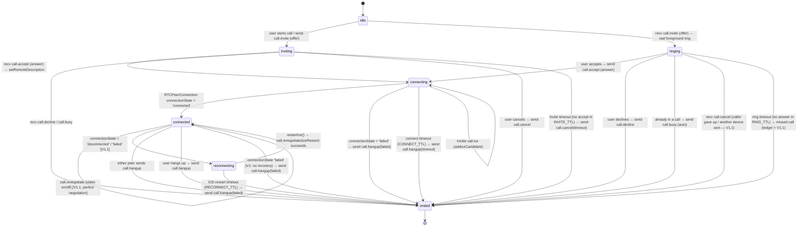
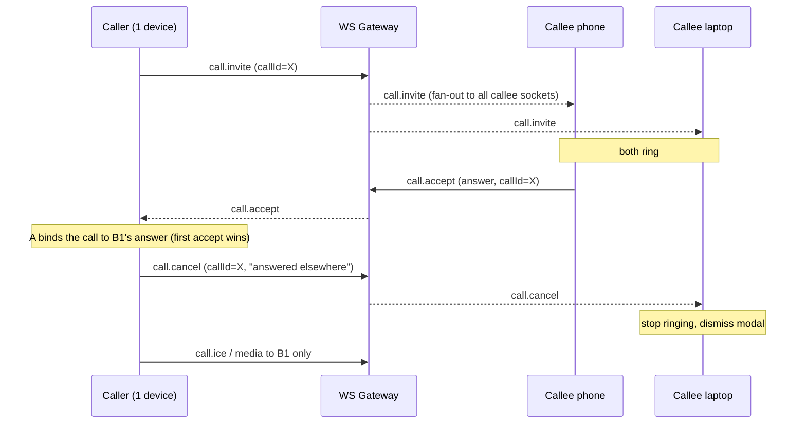

# Call Signaling Protocol & State Machine

> **Scope:** 1:1 calling only (group is a future phase). This document specifies the *signaling* layer — the control-plane messages that establish, maintain, and tear down a WebRTC `RTCPeerConnection` between exactly two argus users. The **V1 cut is 1:1 audio only, relay-only, foreground-ring only (both apps open), single-device per user** (see [./00-overview-and-goals.md](./00-overview-and-goals.md) §4 for the rationale behind that single cut). Everything in this file that exceeds that cut — video, ICE-restart/reconnection, push-wake + missed-call ledger, multi-device ring-all — is built on the **same state machine** but explicitly labelled **V1.1**, so the protocol is designed once and lit up incrementally.
>
> Media-plane (DTLS-SRTP, TURN, IP privacy) lives in [./03-infrastructure-turn-and-networking.md](./03-infrastructure-turn-and-networking.md); the crypto binding (MLS exporter → SAS, authenticated-sender decrypt) lives in [./01-architecture-and-crypto-model.md](./01-architecture-and-crypto-model.md); the threat model lives in [./06-threat-model-and-privacy.md](./06-threat-model-and-privacy.md); server API + database shape live in [./04-server-api-and-database.md](./04-server-api-and-database.md).
>
> **Design stance:** the server is crypto-blind (invariant 1) and stores nothing about call content (invariant 6). Signaling is **ephemeral, never persisted, E2EE inside the MLS envelope, and best-effort relayed** over the existing WebSocket gateway. The control plane is a small, replay-protected state machine; in-call renegotiation is WebRTC's own [perfect-negotiation](https://developer.mozilla.org/en-US/docs/Web/API/WebRTC_API/Perfect_negotiation) pattern, which we adopt verbatim rather than reinventing.

---

## 1. Where signaling rides

### 1.1 Transport: the existing WS gateway, not the message store

Two transport options exist in the codebase (per the contracts grounding):

| Option | Path | Verdict |
|---|---|---|
| **A — flat message stream** (`POST /:conversationId/messages`, persisted) | `apps/api/src/messaging/message-delivery.service.ts` | **Reject.** Signaling would be persisted, paginated, receipted, and latency-bound by a DB write before fan-out. ICE trickle at chat-message latency breaks call setup. |
| **B — transient WS frames** (new `call.*` inbound handlers, no DB write) | `apps/api/src/realtime/realtime.gateway.ts` | **Adopt.** Real-time, ephemeral, drop-if-offline — the correct failure mode for signaling. Emit straight onto `RealtimeBus`, never through a DB transaction. |

This is a deliberate departure from the durable-then-notify pattern used for messages. The ws-gateway grounding flags exactly this: signaling has **no REST backfill** (unlike chat), so a dropped ICE candidate breaks the call rather than being silently recovered later. That is acceptable — a failed call simply fails to connect, and the user retries — but it dictates a requirement baked into the design below: **trickle-ICE candidates must be buffered and individually replaceable**, and in **V1.1** an ICE-restart becomes the recovery path. In **V1 (foreground-ring only)** both apps are open by definition, so the `call.invite` frame reaches a live socket; the out-of-band push-wake for an offline callee is **V1.1** (§7).

### 1.2 The envelope: server sees ciphertext only

Today every message is a flat `CipherEnvelope` (`packages/contracts/src/index.ts:13`) — `{ ciphertext, alg, epoch }` — and **the message "kind" lives inside the encrypted plaintext, never on the wire**. Call signaling reuses this exactly. The discriminated `CallSignal` union (§2) is the *plaintext* that the client MLS-encrypts with `Conversation.encrypt()`; what crosses the gateway is an opaque `CipherEnvelope` plus routing metadata the server needs to fan out:

```
client A                          server (crypto-blind)                 client B
────────                          ─────────────────────                 ────────
CallSignal (plaintext)
  │ Conversation.encrypt()
  ▼
CipherEnvelope { ciphertext, alg, epoch }   ──WS frame──▶  validate membership
  + { conversationId, callId,                              + tenant isolation
      msgSeq } (routing metadata,                          fan out to (tenant, callee sub)
      cleartext, IDs only)          ◀──────────────────   relay envelope unchanged
                                                            │
                                                            ▼  Conversation.decrypt()
                                                          CallSignal (plaintext)
```

The server **never** sees SDP, ICE candidates, or the signal `type`. SDP and ICE are metadata-revealing (codecs, IP candidates, ufrag) and MUST stay inside `ciphertext` to honour invariant 1 — this is non-negotiable and is the single most important property of the whole protocol. The only cleartext the server handles is routing IDs (`conversationId`, `callId`, a per-call monotonic `msgSeq`) — exactly the metadata-only posture invariant 2 permits.

> **MLS for confidentiality — but authenticating the *sender* of a call signal needs a NEW, crypto-reviewer-gated path (invariant 4).** Signaling *encryption* is the same MLS group cipher already used for chat — `packages/crypto/src/index.ts` `Conversation.encrypt/decrypt`. No new cipher, no new key for confidentiality. **However**, the MITM defence for calls — proving the `call.invite`/`call.accept` was authored by the MLS-authenticated peer and not injected by a malicious relay — is *not* free reuse: `Conversation.decrypt()` today is `async decrypt(wire): Promise<string>` (`packages/crypto/src/index.ts:694`), returning a **bare plaintext string with no sender identity**. Binding the DTLS fingerprint to the call's true author therefore requires a **new authenticated-sender decrypt path in `packages/crypto`** (decrypt returning the verified MLS sender alongside the plaintext, plus the exporter-secret fingerprint binding). This is a **hard Phase-0 predecessor of the first connecting call** and is gated by the `crypto-reviewer` subagent. It is specified in [./01-architecture-and-crypto-model.md](./01-architecture-and-crypto-model.md), not here, but the protocol below assumes the verified sender id (`senderUserId`) is available to every inbound handler. The human-verifiable SAS backstop reuses the existing `safetyNumber` (`packages/crypto/src/index.ts:203`).

### 1.3 Server-side gateway changes (PR-sized)

Per the ws-gateway grounding, the insertion points are clean:

1. **`realtime-bus.ts`** — add `CallSignalEvent` interface + Zod schema; add `emitCallSignal` / `onCallSignal` to the abstract `RealtimeBus`. Implement in both `in-process-realtime-bus.ts` and `redis-realtime-bus.ts` (new channel constant + `safeParse` branch in `onPayload`).
2. **`realtime.gateway.ts`** — new inbound `@SubscribeMessage('call.signal')` handler. This is genuinely new: today the gateway only accepts `auth` and `subscribe` inbound; everything else is server→client push. Signaling needs **client→server→peer relay**. The handler: (a) re-verifies membership via `MessagingService.isMember(auth, conversationId)` (same authz REST uses — non-members get an indistinguishable `conversation not found`); (b) applies the per-socket rate limit (`allowSubscribe` pattern) since these frames aren't covered by the HTTP throttler; (c) emits onto the bus **without persisting**.
3. **Fan-out** — `deliverCallSignal` targets the callee. For a 1:1 call we want per-*user* targeting, so reuse the identity-match pattern (`notifyWelcome`-style: match on verified `(tenantId, sub)`). The gateway has **no `deviceId`** dimension (`VerifiedAuth` carries `sub`, `tenantId`, `sid` — no device id). In **V1 (single-device per user)** this fans to the user's one live socket. In **V1.1**, fanning to *every* socket of the callee's `sub` is exactly what gives multi-device ring-all for free, with first-accept-wins enforced at the application layer (§6).

The server adds **zero new tables** for the signaling path itself. The metadata-only `call_sessions` ledger (CDR-style: who/when/duration/relay-used, never SDP/keys) and its `argus_call_prune` role + prune worker are **explicitly V1.1**, covered in [./04-server-api-and-database.md](./04-server-api-and-database.md). V1 keeps zero call-related persistence.

---

## 2. Signal types — `@argus/contracts` Zod schemas

A discriminated union on `type`, following the existing `z.discriminatedUnion` template at `index.ts:237` (`MeSchema`). These schemas live in `packages/contracts/src/index.ts` (shared) and are mirrored in the server-local copy until the server adopts `@argus/contracts` (the two-worlds split noted in the grounding).

> **Validate at every boundary.** The *plaintext* `CallSignal` is validated client-side after `decrypt()`. The server validates only the **outer** `CipherEnvelope` + routing metadata (`CallEnvelopeSchema`) — it cannot and must not parse the inner union.

The union is specified **once, complete**, including the V1.1 variants (`call.renegotiate`, the `media.video` flag, ICE-restart). This keeps the wire format stable across the V1→V1.1 boundary so no contract migration is needed to light up video or reconnection. **In V1, clients never *emit*** `call.renegotiate` or set `media.video: true`; a V1 client that *receives* one simply ignores it (forward-compatible).

### 2.1 Shared primitives

```ts
import { z } from 'zod';

// A call is identified by a UUID **minted server-side** by `POST /calls/:friendUserId/invite`,
// AFTER the friendship gate (see [04 §2.1](./04-server-api-and-database.md)): the caller receives it
// in the invite response, the callee in `CallRingEvent`. Clients never invent it — every WS signaling
// handler rejects a `callId` that is not an active, server-authorized ring, so a caller cannot bypass
// the trusted invite/friendship gate by fabricating one.
// To keep the invite response a **uniform 202** (no friendship/presence oracle), a no-op invite
// (gate fails or callee unreachable) still returns a well-formed but **inactive** callId — never
// registered in the ring map and never rung — so the body is byte-indistinguishable from success
// while the id stays inert at the WS layer. The schema only constrains the shape.
export const CallIdSchema = z.string().uuid();

// Per-call monotonic counter for ordering + replay protection (§8).
// Scoped to (callId, sender); starts at 0, strictly increasing.
export const MsgSeqSchema = z.number().int().nonnegative();

// Opaque to the server; only the two endpoints ever read these.
// SDP is the full session description; we do NOT split m-lines.
export const SdpSchema = z.object({
  type: z.enum(['offer', 'answer']),   // RTCSdpType subset we use
  sdp: z.string().min(1).max(64 * 1024),
});

// A single trickled ICE candidate (RTCIceCandidateInit shape).
// `candidate: ''` is the valid end-of-candidates sentinel.
export const IceCandidateSchema = z.object({
  candidate: z.string().max(1024),
  sdpMid: z.string().max(256).nullable().optional(),
  sdpMLineIndex: z.number().int().nonnegative().nullable().optional(),
  usernameFragment: z.string().max(256).nullable().optional(),
});

export const CallMediaSchema = z.object({
  audio: z.boolean(),
  video: z.boolean(),               // V1: always false on emit; V1.1 enables true
});
```

### 2.2 The discriminated union

```ts
// Every signal carries callId + msgSeq + a CSPRNG nonce (replay defence, §8).
const CallSignalBase = {
  callId: CallIdSchema,
  msgSeq: MsgSeqSchema,
  nonce: z.string().length(32),          // base64url of 24 random bytes (CSPRNG)
  sentAt: z.number().int().positive(),   // client clock, ms; advisory only (timeout uses local clock)
};

export const CallSignalSchema = z.discriminatedUnion('type', [
  // ── Setup ────────────────────────────────────────────────
  z.object({
    ...CallSignalBase,
    type: z.literal('call.invite'),
    media: CallMediaSchema,              // V1: { audio: true, video: false }
    sdp: SdpSchema,                      // the SDP offer (perfect-negotiation: caller is impolite, see §5)
    relayOnly: z.boolean(),             // mirrors caller's IP-privacy pref; informs callee's ICE policy. V1 default = true
  }),
  z.object({
    ...CallSignalBase,
    type: z.literal('call.accept'),
    sdp: SdpSchema,                      // the SDP answer
  }),
  z.object({
    ...CallSignalBase,
    type: z.literal('call.decline'),
    reason: z.enum(['declined', 'busy', 'unsupported']).default('declined'),
  }),
  z.object({
    ...CallSignalBase,
    type: z.literal('call.busy'),       // auto-sent by a device already in a call
  }),
  z.object({
    ...CallSignalBase,
    type: z.literal('call.cancel'),     // caller withdraws before accept (also: cancel-the-rest, §6 — V1.1)
  }),

  // ── In-call ──────────────────────────────────────────────
  z.object({
    ...CallSignalBase,
    type: z.literal('call.ice'),        // trickle ICE; one candidate per frame
    candidate: IceCandidateSchema,
  }),
  z.object({
    ...CallSignalBase,
    type: z.literal('call.renegotiate'),// V1.1: video on/off, screen-share later, ICE-restart
    sdp: SdpSchema,                      // offer or answer per perfect-negotiation roles
    media: CallMediaSchema,
    iceRestart: z.boolean().default(false),
  }),

  // ── Teardown ─────────────────────────────────────────────
  z.object({
    ...CallSignalBase,
    type: z.literal('call.hangup'),
    reason: z.enum(['hangup', 'timeout', 'error', 'failed']).default('hangup'),
  }),
]);

export type CallSignal = z.infer<typeof CallSignalSchema>;
```

### 2.3 The outer envelope the server actually sees

```ts
// What the CLIENT sends INTO the gateway (server validates THIS, not CallSignal).
export const CallEnvelopeSchema = z.object({
  conversationId: z.string().uuid(),
  callId: CallIdSchema,                 // cleartext: routing + dedup only
  msgSeq: MsgSeqSchema,                 // cleartext: server-side per-(callId,sender) replay window
  envelope: CipherEnvelopeSchema,       // { ciphertext, alg, epoch } — the encrypted CallSignal
});
export type CallEnvelope = z.infer<typeof CallEnvelopeSchema>;

// What the gateway FANS OUT to the callee (frame type 'call.signal').
export const CallSignalFrameSchema = CallEnvelopeSchema.extend({
  senderUserId: z.string().uuid(),      // server-verified sub, never client-supplied
  deliverySeq: z.number().int(),        // existing per-socket transport counter (gap detection)
});
```

> **Why `callId` + `msgSeq` are cleartext.** The server needs them to (a) route, (b) enforce a per-`(callId, senderUserId)` replay window without decrypting (§8), and (c) drop duplicates on multi-socket fan-out (V1.1). They are opaque IDs — no content, no meaning derivable — so this is consistent with invariant 2. The *signal type* and all SDP/ICE stay encrypted; the server cannot tell an invite from a hangup.

---

## 3. The call state machine

One state machine per endpoint, per `callId`. WebRTC's own `RTCPeerConnection` lifecycle (the `connectionState` / `iceConnectionState` machine) runs *underneath* this; our machine is the **application/UX layer** that drives and reacts to it.

The diagram is the **full machine including V1.1**. The **V1 subset** is everything except the `reconnecting` state and its edges (ICE-restart recovery) — i.e. V1 is `idle → inviting/ringing → connecting → connected → ended`, with a lost connection in V1 going straight to `ended` rather than attempting recovery.



### 3.1 State semantics

| State | Phase | Meaning | WebRTC under the hood |
|---|---|---|---|
| `idle` | V1 | No active call for this conversation. | No `RTCPeerConnection`. |
| `inviting` | V1 | Caller has sent `call.invite` (offer), awaiting accept/decline. Ringback UX. | PC created, `setLocalDescription(offer)`, trickling ICE. |
| `ringing` | V1 | Callee received an invite and is presenting a **real foreground ring** (in-app modal + ringtone — both apps open in V1). | PC created, `setRemoteDescription(offer)`, buffering early ICE. |
| `connecting` | V1 | Offer/answer exchanged; ICE + DTLS handshaking. | `iceConnectionState` checking → `connectionState` connecting. |
| `connected` | V1 | Media flowing. | `connectionState = 'connected'`. |
| `reconnecting` | **V1.1** | Mid-call connectivity loss; attempting ICE restart. | `connectionState` ∈ {`disconnected`,`failed`}; `restartIce()` issued. |
| `ended` | V1 | Terminal. Tear down PC, stop tracks, release mic/cam. | `pc.close()`. |

> **Receivability terminology — used precisely throughout.** `ringing` here is a **real foreground ring**: an in-app modal with a ringtone, possible only because V1 requires both apps to be open. The two backgrounded variants — Android **wake-banner** (push that usually fires and can show a banner) and iOS **tap-to-join banner** (a notification that is *not* a ring and cannot ring a locked phone) — are **V1.1** push-wake constructs (§7). Never describe the iOS-locked path as "ringing".

### 3.2 Timeouts (all local-clock; never trust `sentAt`)

| Constant | Default | Phase | Applies in | On expiry |
|---|---|---|---|---|
| `INVITE_TTL` | 45 s | V1 | `inviting` (caller) | Send `call.cancel(timeout)`, → `ended`, mark "no answer". |
| `RING_TTL` | 40 s | V1 | `ringing` (callee) | Stop ring, → `ended`. Surface a **client-rendered** "missed call" (the durable missed-call ledger is V1.1, §7.3). Slightly shorter than `INVITE_TTL` so the callee gives up first and the caller's cancel is a confirmation, not a race. |
| `CONNECT_TTL` | 30 s | V1 | `connecting` | Send `call.hangup(timeout)`, → `ended`. Covers TURN-allocation / ICE-gathering stalls. |
| `RECONNECT_TTL` | 15 s | **V1.1** | `reconnecting` | Send `call.hangup(failed)`, → `ended`. |

Timers are reset on relevant inbound signals. All durations are config constants (mirror the `FRIEND_REQUEST_TTL_DAYS` convention in `friends.service.ts`).

---

## 4. Trickle ICE, ICE-restart, and renegotiation

### 4.1 Trickle ICE (V1)

We trickle from the start — sending each candidate as `pc.onicecandidate` fires rather than waiting for full gathering — because it "significantly reduce[s] the setup time for peer connectivity" ([Trickle ICE, BlogGeek.me](https://bloggeek.me/webrtcglossary/trickle-ice/)).

- Each `RTCIceCandidate` → one `call.ice` signal (encrypted). The empty-string candidate (`candidate: ''`) is the **end-of-candidates** sentinel and is forwarded as-is.
- The callee may receive `call.ice` frames **before** `call.invite` is fully processed (fan-out is concurrent). Buffer early candidates and apply them only after `setRemoteDescription`. This is mandatory given the no-backfill transport — a dropped or early ICE frame must not wedge the call.
- ICE-policy (`relay`-only vs `all`) is set on `RTCConfiguration.iceTransportPolicy` from the per-user IP-privacy preference; see [./03-infrastructure-turn-and-networking.md](./03-infrastructure-turn-and-networking.md). **V1 default is relay-only on both ends** (the IP-privacy default), so neither learns the other's host/srflx IP. Direct P2P (`iceTransportPolicy: 'all'`) is the opt-in.

### 4.2 ICE-restart on network change (V1.1)

Trickle ICE handles initial setup; mid-call recovery is a different mechanism and is **V1.1**. In V1, a connection drop ends the call (the user redials). When V1.1 lands: on a Wi-Fi↔cellular switch, a NAT-binding timeout, or `connectionState` → `disconnected`/`failed`, we trigger an **ICE restart**, which "resets ICE so that it creates all new candidates using new credentials, while existing media transmissions continue uninterrupted" ([restartIce, MDN](https://developer.mozilla.org/en-US/docs/Web/API/RTCPeerConnection/restartIce)).

- Trigger: listen for `connectionState`/`iceConnectionState` transitions to `disconnected` (grace period) then `failed`. Call `pc.restartIce()`, which sets the `iceRestart` flag on the next offer and mints a fresh ufrag/password.
- This fires `negotiationneeded`, producing a new offer carried as `call.renegotiate(iceRestart: true)`. The peer applies it and answers — **the same code path as any renegotiation**, which is the elegance of perfect negotiation.
- State: `connected → reconnecting → connected` (or `→ ended` on `RECONNECT_TTL`).

> Use `pc.restartIce()` (the spec-blessed path), **not** a brand-new `RTCPeerConnection`. Reusing the existing PC is the entire point of the pattern ([Perfect negotiation, MDN](https://developer.mozilla.org/en-US/docs/Web/API/WebRTC_API/Perfect_negotiation)).

### 4.3 Renegotiation — video on/off (V1.1)

Toggling the camera, adding video to an audio call, or (future) screen-share all renegotiate the existing PC and are **V1.1** (V1 is audio-only — there is no video to toggle). Driven entirely by WebRTC's `negotiationneeded` event → `call.renegotiate(sdp, media)`. No new state; the call stays `connected`. Mid-call renegotiation is the one place glare can recur (both peers toggle video at once), so it is governed by the same perfect-negotiation roles as the initial invite (§5).

---

## 5. Glare handling — perfect negotiation, two layers

There are **two distinct glare scenarios**, handled differently.

### 5.1 Mid-call renegotiation glare → WebRTC perfect negotiation (V1.1, verbatim)

Once a PC exists (state `connected`/`reconnecting`), simultaneous renegotiation offers are resolved by the standard [perfect-negotiation](https://developer.mozilla.org/en-US/docs/Web/API/WebRTC_API/Perfect_negotiation) pattern, which we adopt without modification. This only fires when there *is* a renegotiation — i.e. video toggle or ICE-restart — so it is **V1.1** in practice, but the roles (§9 `deriveRole`) are assigned at invite time in V1 so no retrofit is needed.

- One peer is **polite** (rolls back its own offer on collision and accepts the incoming one); the other is **impolite** (ignores the colliding incoming offer and wins).
- Collision detection uses a `makingOffer` flag set just before `setLocalDescription`, **not** `signalingState` — "more reliable than depending on signalingState … because creating offer is asynchronous" ([Perfect Negotiation, CallSphere 2026](https://callsphere.ai/blog/vw3e-webrtc-perfect-negotiation-ai-voice-2026)).
- Treat `negotiationneeded` as a hint (it can fire spuriously); reuse the single PC for the call's lifetime.

### 5.2 Call-establishment glare (simultaneous mutual `call.invite`) → deterministic tiebreak (V1)

Perfect negotiation assumes a PC already exists. When **both** users tap "call" at the same instant, there are two independent `call.invite`s and two `callId`s in flight — there is no PC yet to roll back. We need an application-level tiebreak *before* WebRTC's machine engages. **This is V1** — two foreground users can race even in the single-device, foreground-ring world.

**Rule:** when a peer in state `inviting` receives a `call.invite` from the other party (instead of an accept/decline), both peers run the identical deterministic comparison:

```ts
// Both endpoints compute the same winner. No server involvement.
// Compare the two callIds as lowercase UUID strings (byte order),
// mirroring the canonicalPair lowercasing in friends.service.ts.
function invitesGlare(myCallId: string, theirCallId: string): 'keep-mine' | 'take-theirs' {
  return myCallId.toLowerCase() < theirCallId.toLowerCase() ? 'keep-mine' : 'take-theirs';
}
```

- **Winner** (`keep-mine`): silently ignores the incoming invite; its own invite proceeds. The loser will accept it momentarily.
- **Loser** (`take-theirs`): sends `call.cancel` for its own `callId`, transitions `inviting → ringing` for the winner's `callId`, and auto-accepts (or presents the ring, per UX choice — auto-accept is reasonable since the user already expressed call intent).

Using `callId` (a CSPRNG UUID) as the tiebreak key gives a uniformly random, deterministic winner with no clock dependency and no server arbitration. It reuses the exact lowercase-UUID ordering convention already in the codebase (`canonicalPair`, `friends.service.ts:24`), so the comparison matches Postgres byte ordering if it ever needs to be reconciled server-side.

---

## 6. Multi-device fan-out: ring all, first-accept wins, cancel the rest (V1.1)

**V1 is single-device per user**, so this whole section is **V1.1** — it falls out for free once the gateway fans `call.invite` to every connected socket of the callee's `sub` (§1.3). It is documented now so the V1 application code is written multi-device-tolerant from the start (a V1 client must already dedup on `callId` and ignore its own invite echo, which costs nothing).



**Rules (V1.1):**

1. **Ring-all:** all callee devices enter `ringing` on `call.invite`.
2. **First-accept-wins (caller-arbitrated):** the caller binds the call to the **first** `call.accept` it receives for `callId` (by `(senderUserId, msgSeq)` order). It does `setRemoteDescription(answer)` once; subsequent accepts for the same `callId` are dropped.
3. **Cancel-the-rest:** immediately after binding, the caller broadcasts `call.cancel(callId)` to the conversation. The fan-out reaches the *losing* callee devices (and is a harmless no-op on the winner). Losing devices stop ringing → `ended`. A short `aria-live` toast ("Answered on another device") is the only UX.
4. **Self-fan-out guard:** the caller's *own* other devices may also receive the invite (identity-match fans to all of `sub`). Since there's no `deviceId`, dedup on `callId` ownership: a device that *minted* `callId` is the caller and ignores its own invite echo; other devices of the caller suppress it. **This guard is also written in V1** (it is harmless with one device and avoids a retrofit).

> **Caller multi-device** is symmetric but simpler: only the device that initiated owns the `RTCPeerConnection`. True call-handoff between a user's own devices is out of scope for V1 *and* V1.1. Multi-device ring-all also has a hard predecessor — **multi-device MLS** (a user's second device must be in the MLS group to decrypt the signal). That prerequisite is one of the reasons V1 is single-device; see [./00-overview-and-goals.md](./00-overview-and-goals.md) §4.

---

## 7. Reaching an offline / backgrounded callee — push-wake + missed-call (V1.1)

**V1 is foreground-ring only: both apps are open, so `call.invite` lands on a live socket and produces a real ring.** Everything in this section — push-wake, wake-banner, tap-to-join banner, the durable missed-call ledger — is **V1.1**. It is the single most PWA-constrained part of the design and is deliberately deferred so V1 ships without over-promising "rings a locked phone." See [./09-decision-log-and-open-questions.md](./09-decision-log-and-open-questions.md) Q4: the chair ruling is **accept + be honest** — foreground audio for V1, surface call-readiness as a *warning, not a hard block*, and if "rings a locked phone" ever becomes a hard requirement, Capacitor (native wrapper) becomes a V1 prerequisite — a decision fork, not a deferral.

### 7.1 The wake flow (V1.1)

```mermaid
sequenceDiagram
    participant A as Caller
    participant S as Server
    participant P as Push (APNs/FCM via VAPID)
    participant SW as Callee Service Worker
    participant B as Callee PWA
    A->>S: call.invite
    S->>S: callee has no live socket?
    S->>P: send content-free push {type:"call"}
    P-->>SW: push event
    SW->>SW: showNotification("Incoming call", tag=argus-call)
    Note over SW,B: Android = wake-banner (usually fires);<br/>iOS = tap-to-join banner (NOT a ring)
    B->>S: WS connect + auth + subscribe
    Note over A,B: caller still in `inviting` (INVITE_TTL=45s)<br/>callee re-requests current call state → ring (foreground only)
```

- The existing push handler in `apps/web/src/sw.ts` only knows `{"type":"new_message"}`. Add a **`call`** branch: a content-free, high-`urgency` notification ("Incoming call", `tag: 'argus-call'`, `renotify`, `requireInteraction`). No caller name, no `callId` in the payload — invariant 2. The PWA learns *who/what* only after reconnecting and pulling current call state over WS.
- The server's "no live socket → push" decision already exists for messages (`push.notifyConversationMembers`); add a `call`-urgency variant that fires the moment a `call.invite` finds zero live callee sockets.
- `INVITE_TTL` (45 s) is sized to allow a cold PWA wake + WS reconnect + auth + subscribe round-trip.

### 7.2 Be honest about PWA limits (the reason §7 is V1.1)

This is a PWA, not a native app. The limits are real and the mitigations are partial — and they are precisely why the **foreground-only** V1 cut is honest rather than aspirational.

| Limit | Reality | Mitigation |
|---|---|---|
| **No CallKit / ConnectionService** | VoIP push + native full-screen call UI is a **native-only** capability; "PWAs on iOS … cannot directly access VoIP push notification infrastructure or CallKit APIs" ([ConnectyCube 2025](https://connectycube.com/2025/11/06/troubleshooting-common-issues-with-voip-push-notifications-on-ios/)). | Best-effort web-push notification only. On iOS this is a **tap-to-join banner**, never a ring; no full-screen ring, no ring-through-silent-mode, no lock-screen answer. |
| **iOS Web Push = installed PWA only, 16.4+** | Web Push works **only** if the user added the PWA to the Home Screen, on iOS 16.4+ ([MagicBell, 2026](https://www.magicbell.com/blog/pwa-ios-limitations-safari-support-complete-guide)). Safari-tab PWAs get nothing. | `NotificationSettings.tsx` already shows the "install to Home Screen" hint; surface **call-readiness** as a warning (Q4 ruling), not a hard block. |
| **`userVisibleOnly: true` mandated** | The browser **forces a visible notification** for every push; you cannot wake silently to pre-warm a PC. | Accept it — the visible banner *is* the UX. No silent pre-connect. |
| **Background wake is unreliable** | A backgrounded/terminated PWA wakes only via the push; latency depends on APNs/FCM and OS throttling. Android usually fires a **wake-banner**; iOS gives only a **tap-to-join banner**. | Caller-side ringback + generous `INVITE_TTL`; if the callee never wakes, it becomes a clean **missed call**. |

### 7.3 Missed-call path

- **V1 (no ledger):** if `RING_TTL` expires with the callee's one foreground device not answering, the caller's `INVITE_TTL` fires `call.cancel(timeout)` and the callee renders a transient, **client-only** "missed call" state. Nothing is persisted server-side (no `call_sessions`, no `argus_call_prune`, no prune worker — all V1.1).
- **V1.1 (durable ledger):** a durable missed-call record goes through the normal E2EE message path as a typed plaintext (`{kind:'call.missed'}` inside `ciphertext`) so the server stays blind, *and/or* lands as a metadata-only row in the `call_sessions` ledger ([./04-server-api-and-database.md](./04-server-api-and-database.md)). Per the Q3 chair ruling, the V1.1 retention is **30 days** — baked into the prune-policy literal and the [ROPA retention row](#9-gdpr-artifact-updates-phase-0). The TURN credential TTL is a separate dial set to **600 s** (Q6 ruling; see [./03-infrastructure-turn-and-networking.md](./03-infrastructure-turn-and-networking.md)).

---

## 8. Idempotency & replay protection

The gateway verifies the sender's `sub`/`tenantId`, but a malicious or buggy peer/relay could replay or inject frames. Defences are layered.

| Threat | Defence | Where |
|---|---|---|
| **Duplicate fan-out** (same frame to multiple sockets of one user — V1.1) | Dedup on `(callId, senderUserId, msgSeq, nonce)`; first wins, rest ignored. | Client receive loop. |
| **Replay of an old signal** (e.g. resend a stale `call.invite` to re-ring) | **Strictly increasing `msgSeq`** per `(callId, senderUserId)`. A frame with `msgSeq ≤` the highest already seen for that pair is dropped. | Client; server also keeps a small per-`(callId, senderUserId)` high-water mark to drop obvious replays before fan-out (cheap, metadata-only, no decryption). |
| **Cross-call confusion / stale-call injection** | `callId` binds every signal to one call attempt. Signals for an unknown or `ended` `callId` are dropped. | Client. |
| **Forged / injected call signal** (malicious relay authoring a `call.invite`/`call.accept`) | The inner `CallSignal` is inside the **MLS** envelope — only current group members can produce a valid ciphertext, and MLS AEAD + epoch prevent forgery and cross-epoch replay. **Sender authentication of the signal** (which group member actually authored it) requires the **new authenticated-sender decrypt path** in `packages/crypto` (§1.2) — not free reuse. The `nonce` (24 CSPRNG bytes) adds a per-signal uniqueness check at the app layer. | MLS (`packages/crypto`, new path) + client. |
| **SDP/ICE tampering by the relay** (server or TURN MITM) | DTLS fingerprint in the SDP is **bound to the MLS exporter secret** — a swapped fingerprint fails verification. This is the **new, crypto-reviewer-gated** path of §1.2, detailed in [./01-architecture-and-crypto-model.md](./01-architecture-and-crypto-model.md). Out-of-band SAS (safety number) is the human-verifiable backstop, reusing `safetyNumber` from `packages/crypto`. | Crypto layer. |

**Idempotency** of state transitions: every handler is safe under at-least-once delivery. A second `call.accept` after the call is bound is a no-op; a `call.hangup` for an already-`ended` call is a no-op; re-applying an already-added ICE candidate is a no-op (`addIceCandidate` tolerates it). The state machine never transitions backward.

> **CSPRNG only (invariant: no `Math.random`).** `callId` (UUIDv4) and `nonce` use `crypto.randomUUID()` / `crypto.getRandomValues()`, consistent with the crypto-review criteria and the existing CSPRNG audit (`docs/threat-models/csprng-audit.md`).

---

## 9. GDPR artifact updates (Phase-0 deliverable bundle)

Calling introduces new processing activities (relay routing, call-graph/timing metadata) that touch the canonical GDPR/threat artifacts. This is an **enumerated Phase-0 deliverable**, not a vague "flag for the ROPA/DPIA" — mirrored in [./08-roadmap-and-delivery-slices.md](./08-roadmap-and-delivery-slices.md) P0-TM, [./00-overview-and-goals.md](./00-overview-and-goals.md) (process note), and [./06-threat-model-and-privacy.md](./06-threat-model-and-privacy.md) §12 checklist. The four named files and what VoIP does to each:

| File | Action | What VoIP adds |
|---|---|---|
| `docs/gdpr/data-residency.md` | **Revise** | Add a **coturn relay** row: relayed SRTP transits the EU VM; relay is the V1 default, so all default-user media touches it. No media content is decrypted or stored; only ephemeral relay allocations. |
| `docs/gdpr/article-30-records.md` | **Revise** | New **processing activity** ("1:1 calling — signaling relay + TURN media relay"); new **personal-data category** (relay-observed peer IPs at the TURN allocation; call-graph/timing metadata); **APNs/FCM as sub-processor** (V1.1 push-wake); **retention row** = 30 days for the V1.1 `call_sessions` ledger (Q3 ruling). |
| `docs/threat-models/metadata-exposure.md` | **Extend** | New rows: **call-graph** (server infers "A called B"), **call-timing** (start/duration via `call.invite`→`call.hangup` and `call.ice` cadence), **relay-peer-IP** (coturn sees both peers' transport addresses at allocation time). |
| `docs/gdpr/dpia-voip-calling.md` | **Create** | New DPIA: **legal basis per activity** (signaling relay, TURN media relay, V1.1 push-wake, V1.1 metadata ledger), necessity/proportionality of relay-default, and the residual call-graph risk accepted under invariant 6. |

---

## 10. Client placement & type sketches

Per the frontend grounding, the call surface slots in cleanly. **V1** columns marked; the rest is V1.1.

| Concern | File | Phase / Status |
|---|---|---|
| Signaling client (frames `call.signal`) | extend `apps/web/src/lib/ws.ts` (add `call.signal` frame + `onCallSignal`) **or** sibling `apps/web/src/lib/call-signaling.ts` | V1 — new |
| Call state hook (PC + state machine) | `apps/web/src/features/call/useCall.ts` (mirrors `useLiveConversations.ts`) | V1 — new |
| Media capture | `apps/web/src/lib/media-devices.ts` (`getUserMedia` audio, `enumerateDevices`, `permissions.query`) | V1 — new |
| Trigger buttons | `apps/web/src/features/chat/ChatHeader.tsx:252-265` — **inert today**, wire `onClick` (audio call button for V1) | V1 — exists, wire up |
| Call UI | `apps/web/src/features/call/{IncomingCallModal,OutgoingCallModal,InCallScreen}.tsx` (reuse `features/ui/Modal,IconButton,Button`) | V1 — new |
| Push-wake branch | `apps/web/src/sw.ts` — add `call` push type | **V1.1** — exists, extend |
| E2E | new spec under `apps/web/e2e/` with `context.grantPermissions(['microphone'])`; demo-mode fake signaling path | V1 — new |

### 10.1 The hook skeleton (perfect negotiation + state machine)

```ts
// apps/web/src/features/call/useCall.ts (sketch)
type CallState =
  | 'idle' | 'inviting' | 'ringing'
  | 'connecting' | 'connected' | 'reconnecting' /* V1.1 */ | 'ended';

interface CallSession {
  callId: string;
  state: CallState;
  polite: boolean;          // perfect-negotiation role (see deriveRole) — assigned in V1, used in V1.1
  makingOffer: boolean;     // glare detection — NOT signalingState
  ignoreOffer: boolean;     // impolite peer's collision flag
  highWater: Map<string /*senderUserId*/, number /*msgSeq*/>;
  media: { audio: boolean; video: boolean };   // V1: { audio: true, video: false }
}

// Perfect-negotiation role for renegotiation glare (§5.1).
// The CALLER (invite sender) is impolite; the CALLEE is polite — stable for the call's life.
function deriveRole(amCaller: boolean): { polite: boolean } {
  return { polite: !amCaller };
}

// Establishment glare (§5.2): deterministic, callId-based, no PC yet.
function resolveInviteGlare(myCallId: string, theirCallId: string) {
  return myCallId.toLowerCase() < theirCallId.toLowerCase() ? 'keep-mine' : 'take-theirs';
}

// Outbound: build plaintext → MLS-encrypt → wrap → send CallEnvelope over WS.
async function sendSignal(conv: Conversation, signal: CallSignal, conversationId: string) {
  const wire = await conv.encrypt(JSON.stringify(signal));     // packages/crypto
  const envelope: CipherEnvelope = { ciphertext: toB64(wire), alg: 'MLS_1.0', epoch: conv.epoch };
  socket.send('call.signal', { conversationId, callId: signal.callId, msgSeq: signal.msgSeq, envelope });
}

// Inbound: authenticated-sender decrypt → validate → replay-check → dispatch.
async function onCallFrame(frame: CallSignalFrame, conv: Conversation, s: CallSession) {
  // decryptAuthenticated() is the NEW crypto path (§1.2): returns plaintext + verified MLS sender.
  const { plaintext, mlsSender } = await conv.decryptAuthenticated(fromB64(frame.envelope.ciphertext));
  if (mlsSender !== frame.senderUserId) return;                          // sender-binding check
  const signal = CallSignalSchema.parse(JSON.parse(plaintext));
  if (signal.callId !== s.callId && s.state !== 'idle') return;          // cross-call guard
  const seen = s.highWater.get(frame.senderUserId) ?? -1;
  if (signal.msgSeq <= seen) return;                                     // replay drop (§8)
  s.highWater.set(frame.senderUserId, signal.msgSeq);
  dispatch(signal, s);                                                   // drives the §3 state machine
}
```

### 10.2 Perfect-negotiation inbound offer handling (V1.1 renegotiation core)

```ts
// Inside dispatch(), for call.renegotiate / call.accept carrying an offer (V1.1):
const offerCollision =
  signal.sdp.type === 'offer' && (session.makingOffer || pc.signalingState !== 'stable');
session.ignoreOffer = !session.polite && offerCollision;
if (session.ignoreOffer) return;                       // impolite peer wins, drops their offer
if (offerCollision) {
  await Promise.all([
    pc.setLocalDescription({ type: 'rollback' }),      // polite peer rolls back
    pc.setRemoteDescription(signal.sdp),
  ]);
} else {
  await pc.setRemoteDescription(signal.sdp);
}
if (signal.sdp.type === 'offer') {
  await pc.setLocalDescription();                       // implicit answer
  await sendSignal(conv, { ...base, type: 'call.renegotiate', sdp: pc.localDescription, ... }, convId);
}
```

This is the MDN reference implementation, unchanged except that the transport is our encrypted `call.signal` frame instead of a cleartext socket.

---

## 11. PR-sized slices

V1 is the audio core; V1.1 lights up reconnection, multi-device, push, video, and the metadata ledger on the same protocol. The full critical path and dependency graph live in [./08-roadmap-and-delivery-slices.md](./08-roadmap-and-delivery-slices.md); this is the signaling subset.

| Slice | Phase | Deliverable | Gates |
|---|---|---|---|
| **P0 — authenticated-sender crypto** | V1 (Phase-0) | New `decryptAuthenticated()` + exporter-secret fingerprint binding in `packages/crypto`. **Hard predecessor of the first connecting call.** | `crypto-reviewer` pass; unit tests; csprng audit clean. |
| **P0 — GDPR artifacts** | V1 (Phase-0) | The four-file bundle in §9 (revise `data-residency.md` + `article-30-records.md`, extend `metadata-exposure.md`, create `dpia-voip-calling.md`). | Phase-0 DoD checklist. |
| **S1 — contracts** | V1 | Full `CallSignalSchema`, `CallEnvelopeSchema`, `CallSignalFrameSchema` in `@argus/contracts` (+ server-local mirror) with unit tests. Includes V1.1 variants for wire stability; V1 never emits them. | typecheck, test. |
| **S2 — gateway relay** | V1 | `CallSignalEvent` on `RealtimeBus` (both impls); inbound `call.signal` handler with membership authz + rate limit + no-persist fan-out; **threat-model note** `docs/threat-models/call-signaling.md`. | gateway spec pinning authz; `security-boundary-auditor` pass. |
| **S3 — audio happy path** | V1 | `media-devices.ts` (audio), `useCall.ts` (idle→connected→ended), wire `ChatHeader` audio button, basic in-call UI. **Relay-only.** | E2E with granted mic (demo fake path). |
| **S4 — establishment glare** | V1 | `resolveInviteGlare` tiebreak (§5.2), idempotency/replay unit tests. | E2E for glare; replay tests. |
| **S5 — ICE-restart + reconnection** | **V1.1** | `reconnecting` state, `restartIce()`, `call.renegotiate(iceRestart)`. | E2E reconnect. |
| **S6 — multi-device ring-all** | **V1.1** | per-socket fan-out, first-accept-wins, cancel-the-rest (§6). Requires multi-device MLS. | E2E multi-device. |
| **S7 — push-wake + missed-call** | **V1.1** | `sw.ts` `call` branch, server "no live socket → call push", wake-banner / tap-to-join banner, durable missed-call ledger. | E2E offline-wake (mocked push). |
| **S8 — video** | **V1.1** | camera capture, `call.renegotiate(media.video)`, video UI. | E2E video toggle. |
| **S9 — call_sessions ledger** | **V1.1** | metadata-only `call_sessions` table (RLS, leading `tenant_id`, no SDP/keys) + `argus_call_prune` role + 30-day prune worker per [./04-server-api-and-database.md](./04-server-api-and-database.md). | `/db-migration`; threat-model note; boundary-auditor. |

---

## 12. Open questions for the threat model

Carried into [./06-threat-model-and-privacy.md](./06-threat-model-and-privacy.md):

1. **Metadata leakage to the server.** Even with content encrypted, `callId` + `msgSeq` + fan-out timing let the server infer "a call happened, between these two members, for this long." Acceptable under invariant 6 (metadata-only) but stated explicitly in `docs/threat-models/metadata-exposure.md` (§9); consider whether `call.ice` cadence leaks anything beyond "call in progress."
2. **Ring-spam / DoS.** A peer could fire repeated `call.invite`s. Rate-limit inbound `call.signal` per `(senderUserId, conversationId)` at the gateway (reuse `allowSubscribe`), and per-callId on the client.
3. **Establishment-glare auto-accept.** §5.2's loser auto-accepting the winner's call is a UX convenience; confirm it can't be weaponised (it can't — both already expressed call intent toward each other, and friendship gating still applies).
4. **Authenticated-sender + fingerprint binding is load-bearing and is NEW crypto.** The anti-MITM control is the new `decryptAuthenticated()` + exporter-secret fingerprint binding (§1.2, §8) — **not** free reuse of today's `decrypt()`. Until the P0 crypto slice lands, there is **no connecting call**; the manual SAS (`safetyNumber`) is the human-verifiable backstop. Tracked as a hard Phase-0 predecessor, not a known gap to tolerate.

---

**Sources**

- [Establishing a connection: The WebRTC perfect negotiation pattern — MDN](https://developer.mozilla.org/en-US/docs/Web/API/WebRTC_API/Perfect_negotiation)
- [RTCPeerConnection.restartIce() — MDN](https://developer.mozilla.org/en-US/docs/Web/API/RTCPeerConnection/restartIce)
- [Perfect Negotiation in WebRTC for AI Voice: Polite vs Impolite Peer (2026) — CallSphere](https://callsphere.ai/blog/vw3e-webrtc-perfect-negotiation-ai-voice-2026)
- [Trickle ICE explained — BlogGeek.me](https://bloggeek.me/webrtcglossary/trickle-ice/)
- [ICE restart in WebRTC: Recovering Connectivity After Network Changes — BlogGeek.me](https://bloggeek.me/webrtcglossary/ice-restart/)
- [Troubleshooting common issues with VoIP Push Notifications on iOS (2025) — ConnectyCube](https://connectycube.com/2025/11/06/troubleshooting-common-issues-with-voip-push-notifications-on-ios/)
- [PWA iOS Limitations and Safari Support [2026] — MagicBell](https://www.magicbell.com/blog/pwa-ios-limitations-safari-support-complete-guide)
