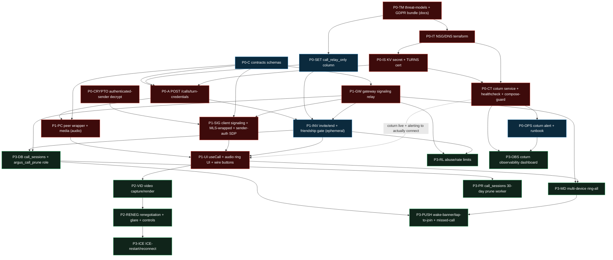

# 08 — Roadmap & Delivery Slices

> Part of the argus VoIP planning set. Siblings: [00 — Overview & goals](./00-overview-and-goals.md) · [01 — Architecture & crypto model](./01-architecture-and-crypto-model.md) · [02 — Signaling protocol & state machine](./02-signaling-protocol-and-state-machine.md) · [03 — Infrastructure: TURN & networking](./03-infrastructure-turn-and-networking.md) · [04 — Server API & database](./04-server-api-and-database.md) · [05 — Frontend PWA & WebRTC](./05-frontend-pwa-and-webrtc.md) · [06 — Threat model & privacy](./06-threat-model-and-privacy.md) · [07 — Comparative survey](./07-comparative-survey.md) · [09 — Decision log & open questions](./09-decision-log-and-open-questions.md)
>
> **Locked scope this roadmap delivers toward:** 1:1 audio + video only (no group/SFU — group is an explicit future phase); self-hosted WebRTC P2P media + self-hosted coturn relay; IP privacy as a per-user setting defaulting to **relay-only**; **PWA only** (Capacitor future). Six security invariants are non-negotiable gates on every slice.
>
> **⚠️ V1 is now AUDIO-FIRST.** Per the scope re-cut recorded in [00 §4](./00-overview-and-goals.md), **V1 = 1:1 audio only, relay-only, foreground-ring only (both apps open), single-device per user.** No `call_sessions` metadata ledger, no `argus_call_prune` role, no prune worker, no push-wake in V1. Video, ICE-restart/reconnection, push-wake + missed-call ledger, multi-device ring-all, and the metadata-ledger/prune chain are an explicit, named **V1.1** phase. This single cut resolves three tensions at once — the multi-device↔MLS prerequisite, the egress-cost-vs-privacy tension, and the iOS-receivability over-promise. The roadmap below is re-drawn around the **~9-slice audio core**.

This file turns the design across docs 01–07 into a **sequenced, PR-sized build plan** matched to the repo's actual workflow: every change lands as a PR against protected `main`, each PR self-reviewed with `/code-review`, gated by CI (`ci · security · codeql`) **and** dual review (Codex + `@claude`), with the pinned domain reviewers (`crypto-reviewer`, `security-boundary-auditor`, `infra-reviewer`) and skills (`/db-migration`, `/feature-threat-model`, `/api-spec`) invoked where their area is touched. Sizes are calibrated for a **solo developer** — they are conservative, and the riskiest work (infra) is front-loaded.

---

## 1. How to read this roadmap

- **Slice = one PR.** Each slice is sized to be reviewable in one sitting and to satisfy a coherent slice of the Definition of Done. Where a slice is large (`L`), it is a candidate to split further if review drags.
- **Size key:** `XS` ≈ <½ day · `S` ≈ ½–1 day · `M` ≈ 1–2 days · `L` ≈ 2–4 days · `XL` = too big, must split. (Solo-dev wall-clock, including review/CI churn — not ideal-engineering hours.)
- **DoD gates** column lists *only the gates that actually apply* to that slice (per AGENTS.md "apply the matching set"). The universal gates — `pnpm -r typecheck && pnpm -r test && pnpm lint && pnpm format:check`, `/code-review` pass, dual review, green CI — apply to **every** slice and are not repeated each row.
- **"Docs/threat-model first"** is a hard ordering rule: a security-relevant slice cannot start coding until its threat-model note is merged or in the same PR ahead of code (DoD).
- **Receivability terms are used precisely** (per [00](./00-overview-and-goals.md), [02](./02-signaling-protocol-and-state-machine.md), [05](./05-frontend-pwa-and-webrtc.md)): **ring** = a real foreground in-app ring with ringtone (the only receivability V1 delivers); **wake-banner** = an Android-backgrounded push that usually fires; **tap-to-join banner** = an iOS-backgrounded notification that is *not* a ring. The iOS-locked path is never called "ringing."

---

## 2. Phase overview

V1 is the audio core (Phase 0 + Phase 1). Everything that turns the demo into a network-resilient, reachable-while-backgrounded product is **V1.1** and beyond.

| Phase | Band | Goal | Outcome you can demo | Net new risk introduced |
|---|---|---|---|---|
| **Phase 0 — Prerequisites** | **V1** | Stand up the rails: authenticated-sender decrypt, relay infra + availability alerting, TURN-cred minting, signaling contracts, GDPR artifacts, threat models | A working coturn relay (with a health alert + runbook) + a `/calls/turn-credentials` endpoint returning ephemeral relay-only creds; schemas merged; authenticated-sender path in `packages/crypto`. No call yet. | The platform's **first public inbound port**; a **new authenticated-sender decrypt path** in `packages/crypto`; first friendship-gated contact path |
| **Phase 1 — 1:1 audio P2P** | **V1** | The first real call | Two **foreground** browsers **ring**, connect, and talk (audio), relay-only by default | First client→server→peer WS relay; mic capture |
| **Phase 2 — Video** | **V1.1** | Add the camera | Audio call upgrades to video; device switch; renegotiation | Camera capture; mid-call renegotiation/glare |
| **Phase 3 — Reliability & reach** | **V1.1** | Survive real networks & reach a backgrounded callee | ICE-restart on Wi-Fi↔cellular; wake-banner / tap-to-join an offline phone; missed-call list; ring-all multi-device; metadata ledger + prune | Web Push call branch; presence-oracle surface; abuse surface; the metadata ledger + retention chain; multi-device↔MLS |
| **Phase 4+ — Future** | Future | Groups & native parity (explicitly deferred) | (not in V1/V1.1) | SFU as a content-bearing element; native CallKit |

**Why audio-first (the one cut, three tensions resolved):**

| Tension the full-scope plan carried | How the audio-first cut dissolves it |
|---|---|
| **Multi-device ↔ MLS** — ring-all needs per-device MLS handling the current single-client model doesn't have | Single-device V1 needs no per-device addressing; multi-device moves to V1.1 *with* its MLS prerequisite |
| **Egress cost vs. privacy** — relay-default video drives B2/VM egress and CPU hardest | Audio relay is ~1–2% of video bitrate; relay-default stays affordable through V1; video egress is a V1.1 decision with data |
| **iOS receivability over-promise** — "it rings" is false on a locked iPhone | V1 promises only a foreground **ring** (both apps open); the honest wake-banner / tap-to-join story is a deliberate V1.1 deliverable, not an implied V1 guarantee |

**Critical path (V1):** Phase 0 crypto+infra (P0-CRYPTO, P0-T*) → TURN creds (P0-A) → audio happy path (P1) → demoable call. The infra slices and the authenticated-sender crypto slice are the long poles; they start first and run in parallel with the pure-software contracts work.

---

## 3. Phase 0 — Prerequisites (V1)

The goal of Phase 0 is that **by the end, a call could be made** — the relay exists *and is monitored*, credentials mint, the wire format is typed, the sender of a call signal can be cryptographically authenticated, and the GDPR/threat-model paper trail is in place — even though no UI wires it together yet. Phase 0 is the highest-risk phase because it breaks the zero-ingress invariant and adds a new crypto path; it is deliberately the most heavily reviewed.

> **No `call_sessions` table in V1.** The metadata ledger, the `argus_call_prune` role, and the prune worker are **V1.1** (Phase 3). V1 audio calls are fully ephemeral: invite/ring/connect/hangup leave **no persisted call record**. The only schema change in V1 is the per-user `call_relay_only` setting column.

### Slice P0-CRYPTO — Authenticated-sender decrypt path (`packages/crypto`)

| | |
|---|---|
| **Scope** | **The MITM defense for call signaling is NOT free.** Authenticating *who sent* a call signal requires a **new authenticated-sender decrypt path** in `packages/crypto`: `Conversation.decrypt()` today returns a bare `string` and surfaces **no sender identity**, so a relayed `call.offer` cannot today be bound to a verified MLS member. Add a sender-attributing decrypt variant (e.g. `decryptAuthenticated(): { plaintext, senderLeafIndex/senderIdentity }`) over the MLS library's existing sender metadata — **no new primitive, but a new, security-critical API surface** that must be `crypto-reviewer`-gated. This is a **hard predecessor of the first connecting call** (P1-SIG): without it, the fingerprint/sender binding in [01](./01-architecture-and-crypto-model.md)/[06](./06-threat-model-and-privacy.md) cannot be enforced. |
| **Files/areas** | `packages/crypto/src/*` (new authenticated-sender decrypt API + unit tests over the MLS sender metadata), rebuild `packages/crypto/dist` if consumed downstream in the same slice |
| **Depends on** | — (can start day one, parallel to infra/contracts) |
| **DoD gates** | unit tests proving sender attribution matches the MLS member; **no hand-rolled crypto** (invariant 4) — strictly a read of library-provided sender metadata; server stays crypto-blind (this runs client-side); no key/plaintext logged |
| **Reviewers** | **`crypto-reviewer` (mandatory)** — this is the single most sensitive crypto change in the VoIP set: it must confirm the path exposes *identity only*, never key material, and adds no primitive |
| **Size** | **M** |

### Slice P0-TM — Threat-model notes + GDPR artifact bundle (docs only)

| | |
|---|---|
| **Scope** | Land the governing threat-model notes **and the four canonical GDPR/repo artifacts before any VoIP code.** Threat-model notes: (1) copy [06](./06-threat-model-and-privacy.md) to `docs/threat-models/voip-calling.md`; (2) write `docs/threat-models/voip-turn.md` (the security story from [03](./03-infrastructure-turn-and-networking.md): first public ingress, NSG allows, coturn crypto-blind, real-IP exposure via the TURN hostname); (3) revise `docs/threat-models/vm-ingress.md` — its "tunnel is the only ingress" assertion becomes false. **GDPR artifact bundle (named files, not "flag for the ROPA"):** (4) revise `docs/gdpr/data-residency.md` — add the **coturn relay row** (EU relay of encrypted SRTP, transient peer IPs); (5) revise `docs/gdpr/article-30-records.md` — add the **new processing activity** (1:1 calling), the **personal-data category** (transient relay peer IP / call-graph metadata), the **APNs/FCM sub-processor** entry (applies once push lands in V1.1), and a **retention row** (call metadata → **30 days**, per the [09](./09-decision-log-and-open-questions.md) Q3 ruling; V1 persists nothing, so the row is dormant until V1.1); (6) **extend** `docs/threat-models/metadata-exposure.md` with **call-graph, call-timing, and relay-peer-IP rows**; (7) **create** `docs/gdpr/dpia-voip-calling.md` — a DPIA stating the **legal basis per processing activity**. |
| **Files/areas** | `docs/threat-models/voip-calling.md` (new), `docs/threat-models/voip-turn.md` (new), `docs/threat-models/vm-ingress.md` (edit), `docs/threat-models/metadata-exposure.md` (extend), `docs/gdpr/data-residency.md` (edit), `docs/gdpr/article-30-records.md` (edit), `docs/gdpr/dpia-voip-calling.md` (new) |
| **Depends on** | — (root of the docs graph) |
| **DoD gates** | `/feature-threat-model` skill to structure the notes; verify against all 6 invariants; the GDPR bundle's seven-artifact checklist (mirrored in [06 §12](./06-threat-model-and-privacy.md)) is complete; **no code gates** (docs PR) |
| **Reviewers** | `security-architect` pass (proactive, pre-coding — architecture/trust-boundary + GDPR scoping work) |
| **Size** | **M** (was S; the GDPR bundle adds real work) |

### Slice P0-C — Signaling contracts (`@argus/contracts`)

| | |
|---|---|
| **Scope** | The Zod schemas only, no behaviour: `CallSignalSchema` (discriminated union), `CallEnvelopeSchema`, `CallSignalFrameSchema`, `CallIdSchema`, `IceCandidateSchema`, `SdpSchema`, `CallMediaSchema` per [02 §2](./02-signaling-protocol-and-state-machine.md); plus `TurnCredentialsRequest/ResponseSchema`, `IceServerSchema`, `CreateCallRequest/Response`, `EndCallRequest`, `CallSettings*` per [04 §2](./04-server-api-and-database.md). For V1 audio, `CallMediaSchema` is audio-only at the type level (video kinds land with P2 in V1.1). Mirror into the server-local copy (the deliberate two-worlds duplication). Unit tests for each schema (valid/invalid, `.strict()` rejection). |
| **Files/areas** | `packages/contracts/src/index.ts` (extend; reuse the `z.discriminatedUnion` template at `index.ts:237`), server-local mirror under `apps/api/src/calls/*.schemas.ts` (new), contract unit tests. Rebuild `packages/contracts/dist` (gitignored — `pnpm --filter @argus/contracts build`). |
| **Depends on** | — (can start immediately, parallel to infra) |
| **DoD gates** | typecheck/test; **no** OpenAPI yet (no routes); no RLS (no tables in this slice) |
| **Reviewers** | none mandatory (no boundary/crypto/infra surface yet); standard dual review |
| **Size** | **S** |

### Slice P0-SET — `call_relay_only` user setting column

| | |
|---|---|
| **Scope** | The **only** V1 schema change: `alter table users add column call_relay_only boolean not null default true` with a scoped `UPDATE (call_relay_only)` grant. Default `true` = relay-only (the locked IP-privacy default). **No `call_sessions` table, no `argus_call_prune` role, no prune policies in V1** — those are V1.1 (P3-DB). Because this rides on the existing `users` table (already `tenant_id` + RLS), it adds no new table and no new RLS policy, only a column + grant. |
| **Files/areas** | `apps/api/src/db/migrations/0045_call_relay_only.sql` (next after `0044`), `apps/api/src/db/schema.ts` (add `users.call_relay_only`) |
| **Depends on** | P0-TM (threat model precedes a security-relevant schema change) |
| **DoD gates** | **`/db-migration`** skill to confirm no new tenant-scoped table is being added unguarded (here: none — column-only on an already-RLS'd table); migration runs in the CI Postgres service; column-scoped grant (least privilege) |
| **Reviewers** | `security-boundary-auditor` (confirms the column rides existing `users` RLS; no new isolation surface) |
| **Size** | **S** (was M — the table/role/prune machinery moved to V1.1) |

### Slice P0-IT — Threat-model + NSG/DNS infra (Terraform)

| | |
|---|---|
| **Scope** | Open the first inbound: Azure NSG `Allow` rules for `3478` udp+tcp, `5349` udp+tcp, and the **narrow** relay range `49160-49260/udp` (above the `deny-all-inbound`), plus `coturn --external-ip` planning. AWS parity (`aws_vpc_security_group_ingress_rule` ×3). Add the TURN hostname DNS-only (grey-cloud) A record. Terraform sketches in [03 §4](./03-infrastructure-turn-and-networking.md). |
| **Files/areas** | `infra/azure/terraform/main.tf` (inbound rules), `infra/aws/terraform/network.tf` (parity), DNS (Cloudflare) |
| **Depends on** | P0-TM (the `voip-turn.md` note must land first — DoD: infra security feature → threat model first) |
| **DoD gates** | `infra-reviewer`; **manual `terraform apply` confirmation** (never auto — AGENTS "Never do"); EU region pinned; Checkov/Trivy in CI |
| **Reviewers** | `infra-reviewer` (mandatory), `security-boundary-auditor` (new ingress = boundary change) |
| **Size** | **M** |

### Slice P0-IS — TURN secret + TURNS cert delivery (Key Vault)

| | |
|---|---|
| **Scope** | Add `turn-shared-secret`, `turn_tls_cert`, `turn_tls_key` to the Key Vault fetch path; deliver as `0444` tmpfs files (fail-closed if absent). DNS-01 cert issuance for the TURN hostname. No coturn service yet — just the secrets in place. |
| **Files/areas** | `infra/stack/secrets/fetch-keyvault-secrets.sh`, `infra/stack/secrets/argus-secrets.service`, Key Vault Terraform (`infra/azure/terraform/keyvault.tf`) |
| **Depends on** | P0-IT (DNS name must exist for the cert) |
| **DoD gates** | `infra-reviewer`, `security-boundary-auditor`; invariant 5 (secrets as files, never env); no secret printed/committed (gitleaks) |
| **Reviewers** | `infra-reviewer`, `security-boundary-auditor` |
| **Size** | **S** |

### Slice P0-CT — coturn Compose service + `turnserver.conf` + healthcheck + `compose-guard` exception

| | |
|---|---|
| **Scope** | Add the hardened `coturn` service to `compose.prod.yaml` (`network_mode: host`, non-root, read-only + `/var/tmp` tmpfs, `cap_drop: ALL` + only `NET_BIND_SERVICE`, resource limits, file-secrets, **`restart: unless-stopped`**, and a **healthcheck** per [03 §3.1](./03-infrastructure-turn-and-networking.md)) and `turnserver.conf` (REST/HMAC `use-auth-secret`, relay range matching the NSG, TURNS cert, abuse controls `no-loopback-peers`/`denied-peer-ip`/`max-bps`/quotas, metadata-only logging, `no-cli`, localhost Prometheus). **Operational hardening (now P0, not P3):** coturn must be **excluded from routine `--force-recreate`** unless its config/image changed (a recreate drops all active relayed calls — see [06 §11](./06-threat-model-and-privacy.md)); document this in the deploy script comments. **Update `compose-guard`** (`.github/workflows/ci.yml:125`) to: still assert zero published `ports:`, and assert exactly one `network_mode: host` service == `coturn`. Full sketches in [03 §3, §9, §11](./03-infrastructure-turn-and-networking.md). |
| **Files/areas** | `compose.prod.yaml`, `infra/stack/coturn/turnserver.conf` (new), `.github/workflows/ci.yml` (compose-guard), `infra/stack/deploy.sh` (force-recreate exclusion comment), `docs/threat-models/vm-ingress.md` (final wording) |
| **Depends on** | P0-IS (secret + cert files must exist), P0-IT (NSG must allow the ports the conf binds) |
| **DoD gates** | `infra-reviewer` (container hardening, deny-internal, quotas, crypto-blind relay, healthcheck present, restart policy); CI `compose-guard` updated and green; **manual deploy confirmation** for `az vm run-command` |
| **Reviewers** | `infra-reviewer` (mandatory) |
| **Size** | **L** (the single hardest infra slice; candidate to split conf-vs-service if review drags) |

### Slice P0-OPS — coturn availability alert + runbook stub (P0, not P3)

| | |
|---|---|
| **Scope** | **Because the relay-only default makes `coturn availability == calling availability` for every default user, coturn uptime is a P0 operational concern — not a Phase-3 nice-to-have.** Land a minimal **uptime/health alert** on coturn (the healthcheck from P0-CT feeding an Alertmanager rule, or a blackbox probe on `5349`) **and a one-page runbook stub** covering the three first-call-day failure modes: **TURN down**, **TURN over quota**, **cert expired**. (Full Grafana dashboards + auth-failure-spike analytics remain P3-OBS in V1.1; this slice is the *minimum* so a solo dev learns the relay is down before users do.) |
| **Files/areas** | `infra/stack/` Alertmanager rule (coturn down), `docs/runbooks/voip-turn.md` (new, stub), wire to the existing alert channel |
| **Depends on** | P0-CT (coturn running with a healthcheck) |
| **DoD gates** | `infra-reviewer`; alert fires on a forced coturn stop (manual verify); runbook covers TURN-down / over-quota / cert-expired; no IPs/creds in alert payloads (invariant 2) |
| **Reviewers** | `infra-reviewer` |
| **Size** | **S** |

### Slice P0-A — `POST /calls/turn-credentials` endpoint

| | |
|---|---|
| **Scope** | New `apps/api/src/calls/` module (`calls.module.ts`, `calls.controller.ts`, `calls.service.ts`). One guarded route that mints ephemeral creds: `username = "<expiry>:<sub>"`, `credential = base64(HMAC-SHA1(username, static-auth-secret))`, short TTL (**default 600 s**, per the [09](./09-decision-log-and-open-questions.md) Q6 ruling). Reads the shared secret via `TURN_SHARED_SECRET_FILE`. **Relay-only shaping**: when the caller's `call_relay_only` is true (the default), respond `iceTransportPolicy:'relay'` and omit any `stun:` server. The `credential` is secret-equivalent — never logged. OpenAPI annotation + controller spec (both tiers). The endpoint takes **no `callId`** and is **per-authenticated-user** — issuance is bounded by short TTL + per-user coturn quota, **not** call-scoped (call-scoping would leak invite success — the presence oracle; see [04 §2.2](./04-server-api-and-database.md)). Detail in [04 §2.2](./04-server-api-and-database.md). |
| **Files/areas** | `apps/api/src/calls/*` (new), `apps/api/openapi.json` (regen), `apps/api/src/calls/calls.controller.spec.ts` (new, using `apps/api/src/common/testing/route-meta.ts`) |
| **Depends on** | P0-C (schemas), P0-SET (`call_relay_only` column), P0-IS (secret file present) |
| **DoD gates** | **`/api-spec`** → OpenAPI refresh + **42Crunch ≥ 90** (this returns secret-equivalent material — synthetic examples only); controller spec pins guard + 200/401/429 and asserts `credential` is never passed to a logger; Zod at boundary; no banned log patterns |
| **Reviewers** | `security-boundary-auditor` (no-log of cred, guarded route, tenant scope), `crypto-reviewer` (HMAC use, no hand-rolled primitive, CSPRNG) |
| **Size** | **M** |

**Phase 0 exit criteria:** coturn is reachable on the TURN hostname **and a health alert + runbook are live**; an authenticated user can `POST /calls/turn-credentials` and receive working relay-only ICE servers (600 s TTL); the contracts + the `call_relay_only` column are merged; the **authenticated-sender decrypt path exists in `packages/crypto`**; and the full GDPR/threat-model artifact bundle (seven files) is in place. No call connects yet — that's Phase 1.

---

## 4. Phase 1 — 1:1 audio P2P (the first real call) (V1)

Phase 1 makes audio calls work end-to-end between two **foreground** browsers, relay-only by default, with a minimal but real UI. Video, reliability, multi-device, and background reach are deliberately out (V1.1) — this phase is about proving the **signaling relay + DTLS-SRTP + MLS-wrapped, sender-authenticated SDP** spine. **Receivability in V1 is foreground ring only** (both apps open); no wake-banner, no tap-to-join — see [00 §4](./00-overview-and-goals.md).

### Slice P1-GW — Gateway signaling relay (server)

| | |
|---|---|
| **Scope** | Add `CallSignalEvent` (+ `CallRingEvent`, `CallEndEvent`) interfaces + Zod schemas to `realtime-bus.ts`; implement `emit/on` in both `in-process-realtime-bus.ts` and `redis-realtime-bus.ts` (new `CALL_CHANNEL` constant + `safeParse` branch; fire-and-forget publish). Add inbound `@SubscribeMessage('call.signal')` + `@SubscribeMessage('call.release')` handlers in `realtime.gateway.ts` that (a) derive identity from the verified socket binding, (b) re-verify membership via `MessagingService.isMember`, (b2) **validate `callId` against the live call-authorization map ([04 §3.2a](./04-server-api-and-database.md)) and that the sender is a participant — silently drop unknown/non-participant frames before any fan-out**, (c) **emit straight onto the bus — no DB write** (V1 calls are ephemeral; the metadata ledger is V1.1), (d) are bounded by a per-socket rate limit reusing the `allowSubscribe` token-bucket (`call.release` drops the authz entry — §3.2a). Per-`(callId, senderUserId)` `msgSeq` high-water replay drop (metadata-only, no decrypt). Insertion points in [02 §1.3](./02-signaling-protocol-and-state-machine.md), [04 §3](./04-server-api-and-database.md). |
| **Files/areas** | `apps/api/src/realtime/realtime-bus.ts`, `in-process-realtime-bus.ts`, `redis-realtime-bus.ts`, `realtime.gateway.ts`, gateway spec |
| **Depends on** | P0-C (schemas); **co-delivered with P1-INV** — P1-INV populates the call-authorization map this slice validates `call.signal` against, so neither relays a real call without the other |
| **DoD gates** | gateway spec pinning the new inbound handlers' authz (membership required **and** `callId` present in the live call-authorization map; non-member/unknown-call → silently dropped) + rate-limit; **no persistence** asserted; crypto-blind (payload forwarded as opaque `z.string()`, never parsed); folds the ephemeral/no-backfill/best-effort-drop semantics into `voip-calling.md` |
| **Reviewers** | `security-boundary-auditor` (authz on the genuinely-new client→server→peer path, no IDOR, no plaintext, tenant isolation via room key) |
| **Size** | **L** |

### Slice P1-INV — REST invite/end + friendship gate + relay-only settings

| | |
|---|---|
| **Scope** | `POST /calls/:friendUserId/invite` (**accepted-friendship gate** via `FriendsService.canonicalPair` + accepted lookup; conversation-membership check; emit `CallRingEvent`; **uniform 202** regardless of online/friend/busy — no oracle). **In V1 the invite writes no `call_sessions` row** (ephemeral) — it is a pure routed ring. `POST /calls/:callId/end` is a best-effort signaling broadcast to the peer (idempotent), **not** a ledger update in V1. `GET/PUT /calls/settings` (the `call_relay_only` toggle). **No `GET /calls/missed` in V1** — the missed-call list needs the ledger and lands in V1.1 (P3-PUSH). This is the **first feature to gate contact on friendship** — new logic, documented as such. It also stands up the **in-memory call-authorization map** (the `callId` lifecycle in [04 §3.2a](./04-server-api-and-database.md)) that the gateway relay (P1-GW) validates `call.signal` frames against. Detail in [04 §2.3–2.5, §6, §7](./04-server-api-and-database.md). |
| **Files/areas** | `apps/api/src/calls/calls.controller.ts` + `calls.service.ts` (extend), `apps/api/openapi.json`, controller spec |
| **Depends on** | P0-A (calls module exists), P0-SET (settings column), P1-GW (`CallRingEvent` on the bus) |
| **DoD gates** | **`/api-spec`** + **42Crunch ≥ 90**; controller spec both tiers (guard posture; uniform-202 no-oracle; 404-no-IDOR on `end`); no persistence asserted (V1 ephemeral); no banned log patterns |
| **Reviewers** | `security-boundary-auditor` (friendship gate, presence-oracle mitigations, IDOR, uniform responses) |
| **Size** | **M** |

### Slice P1-PC — WebRTC peer wrapper + media capture (client lib, audio-only)

| | |
|---|---|
| **Scope** | `lib/peer-connection.ts` (UI-free `RTCPeerConnection` wrapper: create/offer/answer, trickle ICE, `iceTransportPolicy` from the relay-only setting, `bundlePolicy:'max-bundle'`, connection-state events; an ICE-restart **hook stub** wired but not exercised — restart logic is V1.1 P3-ICE). `lib/media-devices.ts` (`getUserMedia` **audio-only**, `enumerateDevices`, `permissions.query` pre-flight). `lib/turn-credentials.ts` (fetch ephemeral creds per call; never cache/log). Unit-tested, no React. Sketches in [05 §2](./05-frontend-pwa-and-webrtc.md). |
| **Files/areas** | `apps/web/src/lib/peer-connection.ts`, `media-devices.ts`, `turn-credentials.ts` (all new) + unit tests |
| **Depends on** | P0-A (creds endpoint), P0-C (`IceServer`/cred response types) |
| **DoD gates** | typecheck/test; no secrets/creds in client logs (invariant 2); CSPRNG only |
| **Reviewers** | `crypto-reviewer` (confirms no primitive in client; cred never logged; relay enforcement is real) |
| **Size** | **M** |

### Slice P1-SIG — Client signaling channel + MLS-wrapped, sender-authenticated SDP

| | |
|---|---|
| **Scope** | `lib/call-signaling.ts` (sibling to `ws.ts`, reusing first-frame-auth + jittered reconnect) carrying `call_*` frames. Outbound: build plaintext `CallSignal` → `Conversation.encrypt()` → wrap as `CipherEnvelope` → send `CallEnvelope`. Inbound: **`Conversation.decryptAuthenticated()` (from P0-CRYPTO)** → bind the signal to the verified sender → `CallSignalSchema.parse` → replay/cross-call guard → dispatch. This is the load-bearing **crypto-blind + authenticated-sender** path: SDP/ICE only ever ride inside MLS ciphertext, and a `call.offer` is only accepted if it decrypts as sent by the expected MLS member (the MITM defense). Detail in [02 §9](./02-signaling-protocol-and-state-machine.md), [05 §2.6](./05-frontend-pwa-and-webrtc.md). |
| **Files/areas** | `apps/web/src/lib/call-signaling.ts` (new), consume `packages/crypto` `Conversation.encrypt` + the new `decryptAuthenticated` |
| **Depends on** | **P0-CRYPTO (authenticated-sender decrypt — hard predecessor)**, P0-C (schemas), P1-GW (gateway frames to talk to) |
| **DoD gates** | typecheck/test; demo signaling stub for E2E; crypto-blindness (server never sees SDP) asserted at the boundary; sender-binding enforced (a signal from an unexpected sender is rejected) |
| **Reviewers** | `crypto-reviewer` (SDP only inside MLS envelope; correct use of the new authenticated-sender API; no new key) |
| **Size** | **M** |

### Slice P1-UI — `useCall` hook + minimal audio call UI + wire the buttons

| | |
|---|---|
| **Scope** | `features/call/useCall.ts` (state machine `idle→outgoing/incoming→connecting→in-call→ended`, owns the PC + streams) + a thin `CallContext`. Minimal UI: `OutgoingCallModal`, `IncomingCallModal` (a real foreground **ring** with ringtone), `InCallScreen` (audio: remote `<audio autoplay>`, mute, hangup, elapsed timer) reusing `features/ui/{Modal,IconButton,Button}`. **Wire the inert `Phone` button** at `ChatHeader.tsx:252–265` (`onStartVoiceCall` prop). Relay-only default applied; the per-user toggle UI in settings. **In-call signaling-lost state:** because a WS-gateway restart kills in-call signaling (mute/hangup/reneg) while media survives ([06 §11](./06-threat-model-and-privacy.md)), the in-call UI shows a **"signaling lost"** indicator when the WS drops mid-call. State machine in [02 §3](./02-signaling-protocol-and-state-machine.md), placement in [05 §1, §3](./05-frontend-pwa-and-webrtc.md). |
| **Files/areas** | `apps/web/src/features/call/{useCall.ts,CallContext.tsx,OutgoingCallModal.tsx,IncomingCallModal.tsx,InCallScreen.tsx,CallControls.tsx}` (new), `apps/web/src/features/chat/ChatHeader.tsx` (wire button), `apps/web/src/features/chat/ChatScreen.tsx` (mount `<CallLayer/>`), `apps/web/src/features/settings/` (relay-only toggle) |
| **Depends on** | P1-PC, P1-SIG, P1-INV |
| **DoD gates** | **E2E `apps/web/e2e/call.spec.ts`** (mocked media: `--use-fake-device-for-media-stream` + `context.grantPermissions(['microphone'])`; demo fake signaling path) — the `e2e` job **gates merge**; a11y (focus to Accept, `aria-live` status, `aria-pressed` on mute) must not regress `a11y-responsive.spec.ts`/`wcag-audit.spec.ts`; autoplay-safe remote audio; signaling-lost state asserted |
| **Reviewers** | standard dual review; `security-boundary-auditor` only if it touches API |
| **Size** | **L** |

**Phase 1 (and V1) exit criteria:** two installed PWAs **both in the foreground** can place and answer a 1:1 **audio** call that **rings**, media relayed by default (peers don't see each other's IP), SDP/ICE never visible to the server and **bound to the authenticated MLS sender**, friendship-gated, single-device, ephemeral (no persisted call record), with a passing mocked-media E2E and a live coturn health alert. This is the first demoable call **and the V1 line**.

---

## 5. Phase 2 — Video (V1.1)

Phase 2 adds the camera and the renegotiation machinery video requires. The signaling spine from Phase 1 is reused; the new risk is mid-call renegotiation/glare and camera-permission UX. **Egress note:** video relay-default is materially more expensive than audio (see [00 §4](./00-overview-and-goals.md), [03](./03-infrastructure-turn-and-networking.md)); confirm the relay cost envelope with real audio-V1 data before shipping video, and re-confirm whether Option (d) (dedicated relay) should become the default before video, per [09](./09-decision-log-and-open-questions.md) Q1.

### Slice P2-VID — Video capture + render + audio↔video upgrade

| | |
|---|---|
| **Scope** | Extend `media-devices.ts` for `video` constraints (`facingMode`, 720p ideal) — **camera only on a video call**, and on the callee **only after accept** (no camera LED while merely ringing). `InCallScreen` renders local + remote `<video autoplay playsinline>` (the `playsinline` is mandatory on iOS). Wire the inert `Video` button at `ChatHeader.tsx`. Extend `CallMediaSchema` to admit video kinds. Detail in [05 §2.3, §2.8](./05-frontend-pwa-and-webrtc.md). |
| **Files/areas** | `apps/web/src/lib/media-devices.ts`, `features/call/InCallScreen.tsx`, `CallControls.tsx`, `ChatHeader.tsx`, `packages/contracts` (video media kinds) |
| **Depends on** | P1-UI |
| **DoD gates** | E2E extends `call.spec.ts` (`camera` permission grant, fake video device); a11y; camera-permission-denied handled gracefully (no crash) |
| **Reviewers** | standard dual review |
| **Size** | **M** |

### Slice P2-RENEG — Renegotiation, device switch, mute/camera controls

| | |
|---|---|
| **Scope** | `call.renegotiate` handling (video on/off mid-call, add video to an audio call) via WebRTC `negotiationneeded` → perfect-negotiation roles (caller impolite / callee polite), with the `makingOffer`/`ignoreOffer` collision flags — the MDN reference pattern. Device switch via `sender.replaceTrack` (no renegotiation). Mute (`track.enabled=false`); camera-off with optional `replaceTrack(null)` to drop the LED. Establishment-glare tiebreak (simultaneous mutual invite) via deterministic `callId` comparison. Detail in [02 §4, §5](./02-signaling-protocol-and-state-machine.md), [05 §2.8](./05-frontend-pwa-and-webrtc.md). |
| **Files/areas** | `apps/web/src/features/call/useCall.ts`, `apps/web/src/lib/peer-connection.ts` |
| **Depends on** | P2-VID |
| **DoD gates** | E2E for video-toggle + device-switch; unit tests for the glare tiebreak + perfect-negotiation collision logic; idempotency under at-least-once delivery |
| **Reviewers** | standard dual review |
| **Size** | **M** |

**Phase 2 exit criteria:** a call can start as audio and add video (or start as video), with mid-call camera toggle, device switching, and glare-safe renegotiation.

---

## 6. Phase 3 — Reliability & reach (V1.1)

Phase 3 is what separates a demo from a usable product: surviving network changes, reaching a **backgrounded** callee, multi-device ringing, the missed-call experience — plus the metadata ledger + prune chain, abuse controls, and full relay observability. This is also where the PWA's honest limits get surfaced in-product with **precise** language: an Android-backgrounded callee gets a **wake-banner**; an iOS-backgrounded callee gets a **tap-to-join banner** (never a "ring").

> **The metadata ledger lives here, not in V1.** `call_sessions` + the `argus_call_prune` role + window-scoped RLS + the prune worker are introduced together in P3-DB / P3-PR, because the first thing that *needs* persisted call metadata is the missed-call list (P3-PUSH). Retention is **30 days** ([09](./09-decision-log-and-open-questions.md) Q3), baked into both the policy literal and the `article-30-records.md` retention row.

### Slice P3-DB — `call_sessions` table + `argus_call_prune` role (V1.1)

| | |
|---|---|
| **Scope** | Migration `00xx_call_sessions.sql`: metadata-only ledger, ENABLE+FORCE RLS scoped `TO argus_app` with the `nullif` guard, leading `tenant_id` index + a `started_at` btree for the prune scan, composite FKs, the terminal-state CHECK, a dedicated **`argus_call_prune`** role with **window-scoped (30-day)** policies + column-scoped grants — applying the [#262 lesson](./06-threat-model-and-privacy.md) (re-scope the table's pre-existing isolation policy `TO argus_app` so the prune role's window policy doesn't OR-combine into a live-row bypass). **No deletion worker in this slice** (boundary-only, mirroring the Track-4 `0044` pattern). Metadata-only columns: no SDP, no keys, no content. Full migration sketch in [04 §4.2](./04-server-api-and-database.md). |
| **Files/areas** | `apps/api/src/db/migrations/00xx_call_sessions.sql` (new), `apps/api/src/db/schema.ts` (add `call_sessions` pgTable), and wire `P1-INV`/`P1-GW` to write the ledger rows now that it exists |
| **Depends on** | P1-INV, P1-GW (the routes/handlers that will now persist), P0-TM (threat model precedes the table) |
| **DoD gates** | **`/db-migration`**; `tenant_id` + RLS (ENABLE+FORCE, `TO argus_app`) + leading `tenant_id` index = hard block if missing; the #262 OR-combine bypass explicitly checked; migration runs in CI Postgres; metadata-only (no SDP/keys) |
| **Reviewers** | `security-boundary-auditor` (RLS, the #262 `TO argus_app` scoping lesson, no cross-tenant read, prune-role least privilege) |
| **Size** | **M** |

### Slice P3-ICE — ICE-restart & reconnection UX

| | |
|---|---|
| **Scope** | On `connectionState='disconnected'` → `reconnecting` (keep last frame, don't tear down); on `'failed'` → `pc.restartIce()` → fresh offer over `call.renegotiate(iceRestart:true)` (re-fetch TURN creds if expired). Give-up timer (`RECONNECT_TTL` ~15 s) → `ended(failed)` with a clear "Call again" affordance. Bounded resend of the restart offer (no backfill). **This is also the only recovery for a coturn restart dropping an active relayed call** ([06 §11](./06-threat-model-and-privacy.md)) — without ICE-restart, a coturn bounce ends every in-flight call hard. Detail in [02 §4.2](./02-signaling-protocol-and-state-machine.md), [05 §4](./05-frontend-pwa-and-webrtc.md). |
| **Files/areas** | `apps/web/src/features/call/useCall.ts`, `apps/web/src/lib/peer-connection.ts` |
| **Depends on** | P2-RENEG (reuses the renegotiation path) |
| **DoD gates** | live two-peer nightly smoke (non-gating, mirrors the nightly DAST posture — UDP-relay flows are CI-fragile); unit tests for the reconnect state transitions |
| **Reviewers** | standard dual review |
| **Size** | **M** |

### Slice P3-MD — Multi-device ring-all / first-accept / cancel-the-rest

| | |
|---|---|
| **Scope** | Ring-all falls out of identity fan-out (gateway has no `deviceId`). Caller binds the **first** `call.accept` for a `callId`, then broadcasts `call.cancel` ("answered elsewhere") to stop the losing devices; self-fan-out guard (a device ignores its own invite echo). Server-side `answered-elsewhere` `CallEndEvent` to the callee's other sockets when one device answers. **This is where the multi-device↔MLS prerequisite is paid down** — V1's single-device cut deferred per-device addressing precisely so this could be done deliberately. Detail in [02 §6](./02-signaling-protocol-and-state-machine.md), [04 §3.3](./04-server-api-and-database.md). |
| **Files/areas** | `apps/api/src/realtime/realtime.gateway.ts` (answered-elsewhere fan-out), `apps/web/src/features/call/useCall.ts` |
| **Depends on** | P1-GW, P1-UI |
| **DoD gates** | E2E (two callee contexts, first-accept wins, other dismisses); gateway spec for the answered-elsewhere fan-out |
| **Reviewers** | `security-boundary-auditor` (fan-out stays within `(tenant, sub)`, no cross-tenant leak) |
| **Size** | **M** |

### Slice P3-PUSH — Push-to-wake (wake-banner / tap-to-join) + missed-call UX + honest-limits explainer

| | |
|---|---|
| **Scope** | Add a `call`/`incoming_call` branch to the SW `push` handler in `apps/web/src/sw.ts` — **content-free** ("Incoming call", `tag:'argus-incoming-call'`, `requireInteraction`, no caller identity per invariant 2); `notificationclick` focuses/opens the PWA, which then connects WS and drains the encrypted offer. Server fires the call-push the moment a `call.invite` finds zero live callee sockets (reuse `push.notifyConversationMembers`). **Use precise terms in UI + docs:** on Android this presents as a **wake-banner** (usually fires); on iOS-installed-PWA it is a **tap-to-join banner** (NOT a ring) — never call the iOS path "ringing." Missed-call list from `call_sessions` (`answered_at IS NULL`) — depends on P3-DB. Screen Wake Lock during `in-call`. **One-time in-product explainer** about PWA reach limits (install-to-Home-Screen prerequisite; iOS tap-to-join caveat). **APNs/FCM as a sub-processor is now live** — confirm the `article-30-records.md` sub-processor row added in P0-TM is accurate. Detail in [02 §7](./02-signaling-protocol-and-state-machine.md), [05 §5](./05-frontend-pwa-and-webrtc.md). |
| **Files/areas** | `apps/web/src/sw.ts`, `apps/api/src/messaging/message-delivery.service.ts` (call-push trigger) or a calls-service push hook, `apps/web/src/features/settings/NotificationSettings.tsx` (call-readiness warning + explainer), missed-call UI |
| **Depends on** | P3-DB (missed records), P1-UI, P3-MD |
| **DoD gates** | E2E offline-wake (mocked push); push stays content-free (invariant 2) — assert no caller/conversation/SDP in payload; `INVITE_TTL`/`RING_TTL` tuned for cold-wake round-trip; call-readiness surfaced as a **warning, not a hard block** ([09](./09-decision-log-and-open-questions.md) Q4) |
| **Reviewers** | `security-boundary-auditor` (content-free push, no metadata leak in payload) |
| **Size** | **L** |

### Slice P3-RL — Abuse controls & rate limits (server)

| | |
|---|---|
| **Scope** | HTTP throttler on `POST /calls/turn-credentials` (~30/min/user) and on `invite` (per-(caller→callee) cooldown + global per-caller cap; idempotent re-ring while `ringing`); per-socket token-bucket on inbound `call.*` WS frames (extend `allowSubscribe`); non-friend invite = silent no-op (still 202); uniform ring timeout so connect-speed isn't a presence probe. "Block" covered transitively by unfriend (hard-DELETE removes call ability) for V1.1; a dedicated block list is Enterprise-optional. Detail in [04 §8](./04-server-api-and-database.md), [06 §9](./06-threat-model-and-privacy.md). |
| **Files/areas** | `apps/api/src/calls/calls.controller.ts` (throttler), `apps/api/src/realtime/realtime.gateway.ts` (per-socket bucket on `call.*`) |
| **Depends on** | P1-GW, P1-INV |
| **DoD gates** | controller/gateway specs for the limits; boundary review confirms WS frames are actually rate-limited (they bypass the HTTP throttler) |
| **Reviewers** | `security-boundary-auditor` |
| **Size** | **M** |

### Slice P3-PR — `argus_call_prune` TTL worker (30-day)

| | |
|---|---|
| **Scope** | The retention worker for `call_sessions`: `infra/retention/prune-call-sessions.sh` + systemd `.service`/`.timer`, granting `argus_call_prune` LOGIN-NULL on the local socket and batch-reaping rows past the **30-day** window (matching the P3-DB policy literal and the `article-30-records.md` retention row — [09](./09-decision-log-and-open-questions.md) Q3). Mirrors the Track-4 `0044` worker pattern. Detail in [04 §5](./04-server-api-and-database.md). |
| **Files/areas** | `infra/retention/prune-call-sessions.sh` (new), systemd unit files, runbook note |
| **Depends on** | P3-DB (the role + window policies merged) |
| **DoD gates** | `infra-reviewer`; least-privilege role (window-scoped RLS, column-scoped grants); manual deploy confirmation; never deletes a row newer than the 30-day interval |
| **Reviewers** | `infra-reviewer` |
| **Size** | **S** |

### Slice P3-OBS — coturn observability (Grafana dashboard + analytics alerts)

| | |
|---|---|
| **Scope** | The **full** observability layer on top of the P0-OPS health alert: scrape coturn's localhost Prometheus endpoint; Grafana panel (concurrent allocations, relay bps, auth-failure rate); analytics alerts on auth-failure spike (credential leak/attack), total-quota saturation (capacity ceiling), sustained relay bps near link cap. Confirm coturn logs are **excluded** from the long-term Loki store (metadata/IP minimization). Detail in [03 §9](./03-infrastructure-turn-and-networking.md). |
| **Files/areas** | `infra/stack/` observability config (Prometheus scrape, Grafana dashboard, Alertmanager analytics rules), Alloy pipeline (drop/scrub coturn) |
| **Depends on** | P0-CT (coturn Prometheus), P0-OPS (extends the basic alert) |
| **DoD gates** | `infra-reviewer`; no IPs/credentials shipped to long-term logs (invariant 2) |
| **Reviewers** | `infra-reviewer` |
| **Size** | **S** |

**Phase 3 (V1.1) exit criteria:** calls survive Wi-Fi↔cellular handoff (and a coturn bounce via ICE-restart), a backgrounded installed-PWA callee gets a **wake-banner** (Android) or **tap-to-join banner** (iOS) with honest expectations set, missed calls show up, multiple devices ring with first-accept-wins, abuse is rate-limited, call metadata is persisted and self-expires at **30 days**, and the relay has full observability.

---

## 7. Phase 4+ — Future (explicitly deferred)

These are **not V1/V1.1**. They are listed so the architecture leaves their doors open (per [01 §5](./01-architecture-and-crypto-model.md) and [07](./07-comparative-survey.md)), and each carries net-new threat surface requiring its own threat-model addendum before any code.

| Future slice | Scope | Why deferred / what it unlocks | New risk to model first |
|---|---|---|---|
| **F-EXPORT** | Wire `Conversation.exportKey(label, context, length)` over the already-present `mlsExporter` in ts-mls (a small, dependency-free **async** shim — see [09](./09-decision-log-and-open-questions.md) Q5: exporter key is **not** used in V1, and the shim is async) | Prerequisite for SFrame group keying; **not** used in V1/V1.1 (1:1 P2P DTLS-SRTP needs no exporter) | A code path that serialized an exported key toward the server would break invariant 1 — `crypto-reviewer` gate |
| **F-SFU** | Self-hosted SFU (group media topology), forwarding opaque frames | Group calls; the SFU terminates per-hop DTLS-SRTP, so it becomes a content-bearing element | The SFU is a **new metadata holder** (sees all participants' flows); full threat-model addendum |
| **F-SFRAME** | **SFrame (RFC 9605)** keyed from the MLS exporter (per-epoch/per-sender), Encoded Transforms (`RTCRtpScriptTransform`) running encrypt/decrypt **in a Web Worker** | Restores E2EE through the SFU (the Wire/Matrix/Jitsi double-encryption pattern) — keeps invariant 1 intact for groups | Hand-rolled-crypto risk if not via a vetted SFrame lib; `crypto-reviewer` |
| **F-CALLKIT** | Capacitor native wrapper for **CallKit (iOS) / ConnectionService (Android)** — real lock-screen ring, VoIP push, full-screen call UI | The **only** way to match native-grade background ringing; the field offers no PWA fix (see [05 §5](./05-frontend-pwa-and-webrtc.md), [07](./07-comparative-survey.md)). **Decision fork, not a deferral** ([09](./09-decision-log-and-open-questions.md) Q4): if "rings a locked phone" is ever a hard requirement, Capacitor becomes a V1 prerequisite, not a future nice-to-have | Native push/credential handling; new platform attack surface |
| **F-SCREEN** | Screen-share via `getDisplayMedia()` + `replaceTrack`/renegotiation | Nice-to-have once the renegotiation path is mature; UI affordance + privacy prompt | Inadvertent content capture; minor |
| **F-BLOCK** | Dedicated block list (beyond transitive-via-unfriend) | Enterprise-optional; unfriend hard-DELETE already removes call ability | low |

> **Hold the line.** The comparative survey ([07](./07-comparative-survey.md)) is unanimous: groups are a *topology change*, not a feature flag (SFU + a second E2EE layer = a whole project). Do not let "we might do groups" pull SFU complexity into V1/V1.1.

---

## 8. Dependency graph & critical path

The V1 critical path is the **~9-slice audio core**: the authenticated-sender crypto slice + the infra chain converge with the pure-software signaling chain at `P1-UI`. V1.1 (Phase 2/3) hangs off `P1-UI` and `P1-GW`.



**V1 critical path (red), audio core:**

```
P0-TM → P0-IT → P0-IS → P0-CT → P0-OPS   (infra: the long pole — manual terraform/deploy gates + relay alerting)
P0-CRYPTO ───────────────────────┐       (authenticated-sender decrypt — hard predecessor of P1-SIG)
P0-C ──────────┬→ P0-A → P1-PC ──┤
               │                  ├→ P1-UI   (first demoable audio ring/call = V1 line)
P0-C → P1-GW → P1-SIG ───────────┤
P0-A → P1-INV (needs P1-GW) ─────┘
P0-CT/P0-OPS ····(coturn live + monitored)····→ P1-UI
```

The dominant constraint is **infra**: `P0-TM → P0-IT → P0-IS → P0-CT → P0-OPS` is strictly serial (threat model → terraform → secret/cert → service → alerting), and each infra step carries a **manual confirmation** gate (`terraform apply`, `az vm run-command`) that a solo dev cannot parallelize away. Two other long poles run **in parallel** with it: the **authenticated-sender crypto slice** (`P0-CRYPTO`, a hard predecessor of `P1-SIG`) and the pure-software signaling chain (`P0-C → P1-GW → P1-SIG`). All three converge at `P1-UI`. The software chain cannot *demonstrate* a connected call until `P0-CT` lands the live, monitored relay. So: **start P0-TM + P0-C + P0-CRYPTO on day one**, fork the infra chain and the software chain, and converge at `P1-UI`. V1 ends there; everything below is V1.1.

---

## 9. Solo-dev sequencing advice

- **The audio cut is the whole point — don't let V1.1 creep back into V1.** Video, push/reach, multi-device, and the metadata ledger are explicitly V1.1. If a "small" addition pulls `call_sessions`, push, or video into the audio core, it has un-resolved the three tensions the cut was made to resolve ([00 §4](./00-overview-and-goals.md)).
- **Front-load the scary infra.** `P0-CT` (coturn + `compose-guard` + the first public port) is the single highest-risk slice and the one most likely to need an `infra-reviewer` round-trip. Do it early while you have appetite for it; don't let it block UI momentum (the software chain runs alongside). **Treat coturn availability (`P0-OPS`) as part of "done" for the relay** — relay-default means a dead, unmonitored coturn = total calling outage with no alert.
- **The authenticated-sender crypto slice (`P0-CRYPTO`) is a real, reviewer-gated piece of work, not a freebie.** It is a hard predecessor of the first connecting call. Start it day one alongside the docs/contracts so `crypto-reviewer` has time for a round-trip.
- **Land docs-only and contracts-only PRs first.** `P0-TM` (now including the GDPR bundle) and `P0-C` are fast, unblock everything, and bank reviewer goodwill before the heavy slices.
- **Treat the manual-confirmation slices as scheduled events**, not interrupts: `P0-IT` (terraform apply), `P0-CT`/`P3-PR` (vm run-command) each need a deliberate, human-in-the-loop deploy window. Batch them.
- **Keep the gating E2E mocked.** Per [05 §7](./05-frontend-pwa-and-webrtc.md), the merge-gating `call.spec.ts` uses fake media + a demo signaling stub; the *real* two-peer/coturn smoke runs as a **non-gating nightly** (UDP-relay in CI is fragile). This keeps the merge gate fast and deterministic for a solo dev.
- **One `/code-review` per PR, domain reviewers per area, dual review always.** Don't over-review the XS/S slices; spend the deep `security-architect`/`/code-review ultra` budget at phase boundaries (end of Phase 0, end of V1) per the milestone-review rule.
- **The friendship gate (`P1-INV`) is genuinely new product behavior** — it's the first time contact is gated on an accepted friendship. Call it out in the PR description's "what changed and why" for the product-owner read, since it changes who can reach whom.
- **Set iOS expectations honestly in-product the moment push lands (V1.1, `P3-PUSH`)** — the iOS-backgrounded path is a **tap-to-join banner**, surfaced as a call-readiness **warning, not a hard block** ([09](./09-decision-log-and-open-questions.md) Q4). If a stakeholder ever makes "rings a locked iPhone" a hard requirement, that is a **decision fork to Capacitor (F-CALLKIT) as a V1 prerequisite**, not a V1.1 deferral.
- **After each merged phase, `/compact`** and re-baseline against this roadmap.

---

## 10. Per-slice DoD gate matrix (quick reference)

Universal gates (every slice, not repeated below): `pnpm -r typecheck && pnpm -r test && pnpm lint && pnpm format:check`; one `/code-review` pass over the branch diff; dual review (Codex + `@claude`); green CI (`ci · security · codeql`).

| Slice | Band | E2E | OpenAPI + 42Crunch | RLS / `/db-migration` | Threat-model / GDPR | crypto-reviewer | boundary-auditor | infra-reviewer | Manual deploy confirm |
|---|---|:--:|:--:|:--:|:--:|:--:|:--:|:--:|:--:|
| P0-CRYPTO | V1 | | | | | ✅ | | | |
| P0-TM | V1 | | | | ✅ (authors 7 files) | | (architect) | | |
| P0-C | V1 | | | | | | | | |
| P0-SET | V1 | | | ✅ (column-only) | (precedent) | | ✅ | | |
| P0-IT | V1 | | | | ✅ (precedes) | | ✅ | ✅ | ✅ terraform |
| P0-IS | V1 | | | | | | ✅ | ✅ | |
| P0-CT | V1 | | | | (edits vm-ingress) | | | ✅ | ✅ vm run-command |
| P0-OPS | V1 | | | | | | | ✅ | (alert deploy) |
| P0-A | V1 | | ✅ | | | ✅ | ✅ | | |
| P1-GW | V1 | | | | ✅ (signaling) | | ✅ | | |
| P1-INV | V1 | | ✅ | (no table — ephemeral) | | | ✅ | | |
| P1-PC | V1 | | | | | ✅ | | | |
| P1-SIG | V1 | (stub) | | | | ✅ | | | |
| P1-UI | V1 | ✅ gate | | | | | | | |
| P2-VID | V1.1 | ✅ | | | | | | | |
| P2-RENEG | V1.1 | ✅ | | | | | | | |
| P3-DB | V1.1 | | | ✅ | (#262 lesson) | | ✅ | | |
| P3-ICE | V1.1 | nightly | | | | | | | |
| P3-MD | V1.1 | ✅ | | | | | ✅ | | |
| P3-PUSH | V1.1 | ✅ | | (uses table) | (APNs/FCM ROPA) | | ✅ | | |
| P3-RL | V1.1 | | | | | | ✅ | | |
| P3-PR | V1.1 | | | (uses role) | | | | ✅ | ✅ vm run-command |
| P3-OBS | V1.1 | | | | | | | ✅ | |

---

*This roadmap is planning only — nothing here is implemented. It sequences the work described across [01](./01-architecture-and-crypto-model.md)–[07](./07-comparative-survey.md) into PR-sized slices that conform to the repo's slice/PR workflow, the six security invariants, and the Definition of Done. **V1 = the audio core (Phase 0 + Phase 1); V1.1 = video, reach, multi-device, and the metadata ledger.***
